<H1><center>專題計劃書</center></H1>

<H1><center>Kaggle 機器學習競賽</center></H1>

<H2><center>陳鐸元 呂振麒 李宓</center></H2>

## 大綱
* 選定題目
* 下載 data set
* 預測
	* 預備
	* 載入 data set
	* 分析
	* 將字串轉成數字型態
	* 利用隨機森林選取重要特徵
	* Model: Random Forest
	* Model: Gradient Boosting
	* Model: Logistic Regression
	* One Hot Encoding 解決 Categorial Features
	* 資料正規化
	* 主成份分析
	* 線性判別分析
	* Model: Support Vector Machine
	* Model: K Nearist Neighbors
* 選擇一個結果上傳
* 排名
* 目標


## 選定題目


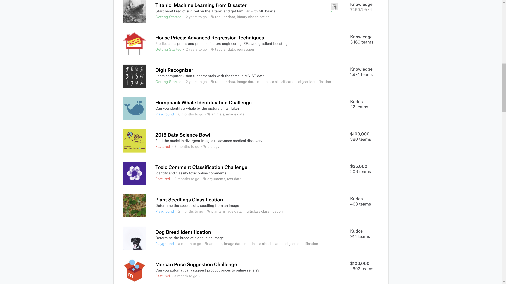

## 下載 data set


## 預測

### 預備

```python
# data analysis and wrangling
import pandas as pd
import numpy as np
import random as rnd

# Resampling
from imblearn.under_sampling import NearMiss
from imblearn.under_sampling import RandomUnderSampler

# visualization
import seaborn as sns
import matplotlib as mpl
import matplotlib.pyplot as plt
import matplotlib.pylab as pylab
%matplotlib inline

# machine learning
from sklearn.linear_model import LogisticRegression
from sklearn.svm import SVC, LinearSVC
from sklearn.ensemble import RandomForestClassifier
from sklearn.ensemble import GradientBoostingClassifier
from sklearn.neighbors import KNeighborsClassifier
from sklearn.naive_bayes import GaussianNB
from sklearn.linear_model import Perceptron
from sklearn.linear_model import SGDClassifier
from sklearn.tree import DecisionTreeClassifier
from sklearn.metrics import classification_report
from sklearn.metrics import confusion_matrix
from sklearn.model_selection import GridSearchCV
from sklearn.model_selection import train_test_split
from sklearn.model_selection import StratifiedKFold
from sklearn.model_selection import cross_validate
from sklearn.preprocessing import StandardScaler
from sklearn.preprocessing import OneHotEncoder
from sklearn.preprocessing import LabelEncoder
from sklearn.decomposition import PCA
from sklearn.discriminant_analysis import LinearDiscriminantAnalysis
from sklearn.feature_selection import RFECV


# session
import pickle
```


```python
# helper functions
def plot_histograms( df , variables , n_rows , n_cols ):
    fig = plt.figure( figsize = ( 16 , 12 ) )
    for i, var_name in enumerate( variables ):
        ax=fig.add_subplot( n_rows , n_cols , i+1 )
        df[ var_name ].hist( bins=10 , ax=ax )
        ax.set_title( 'Skew: ' + str( round( float( df[ var_name ].skew() ) , ) ) ) # + ' ' + var_name ) #var_name+" Distribution")
        ax.set_xticklabels( [] , visible=False )
        ax.set_yticklabels( [] , visible=False )
    fig.tight_layout()  # Improves appearance a bit.
    plt.show()

def plot_distribution( df , var , target , **kwargs ):
    row = kwargs.get( 'row' , None )
    col = kwargs.get( 'col' , None )
    facet = sns.FacetGrid( df , hue=target , aspect=4 , row = row , col = col )
    facet.map( sns.kdeplot , var , shade= True )
    facet.set( xlim=( 0 , df[ var ].max() ) )
    facet.add_legend()

def plot_categories( df , cat , target , **kwargs ):
    row = kwargs.get( 'row' , None )
    col = kwargs.get( 'col' , None )
    facet = sns.FacetGrid( df , row = row , col = col )
    facet.map( sns.barplot , cat , target )
    facet.add_legend()

def plot_correlation_map( df ):
    corr = df.corr()
    _ , ax = plt.subplots( figsize =( 12 , 10 ) )
    cmap = sns.diverging_palette( 220 , 10 , as_cmap = True )
    _ = sns.heatmap(
        corr,
        cmap = cmap,
        square=True,
        cbar_kws={ 'shrink' : .9 },
        ax=ax,
        annot = True,
        annot_kws = { 'fontsize' : 12 }
    )

def describe_more( df ):
    var = [] ; l = [] ; t = []
    for x in df:
        var.append( x )
        l.append( len( pd.value_counts( df[ x ] ) ) )
        t.append( df[ x ].dtypes )
    levels = pd.DataFrame( { 'Variable' : var , 'Levels' : l , 'Datatype' : t } )
    levels.sort_values( by = 'Levels' , inplace = True )
    return levels

def plot_variable_importance( X , y ):
    tree = RandomForestClassifier( n_estimators = 10, n_jobs = -1 )
    tree.fit( X , y )
    plot_model_var_imp( tree , X , y )

def plot_model_var_imp( model , X , y ):
    imp = pd.DataFrame(
        model.feature_importances_  ,
        columns = [ 'Importance' ] ,
        index = X.columns
    )
    imp = imp.sort_values( [ 'Importance' ] , ascending = True )
    imp[ : 10 ].plot( kind = 'barh' )
    print (model.score( X , y ))

def plot_RFECV( X , y ):
    # Create the RFE object and compute a cross-validated score.
    svc = SVC(kernel="linear", n_jobs = -1)
    # The "accuracy" scoring is proportional to the number of correct
    # classifications
    rfecv = RFECV(estimator=svc, step=1, cv=StratifiedKFold(3),
                  scoring='accuracy')
    rfecv.fit(X, y)

    print("Optimal number of features : %d" % rfecv.n_features_)

    # Plot number of features VS. cross-validation scores
    plt.figure()
    plt.xlabel("Number of features selected")
    plt.ylabel("Cross validation score (nb of correct classifications)")
    plt.plot(range(1, len(rfecv.grid_scores_) + 1), rfecv.grid_scores_)
    plt.show()
```

### 載入 data set

```python
# load data
train = pd.read_csv('./train.csv', low_memory=False)
test = pd.read_csv('./test.csv', low_memory=False)
```

### 分析

```python
# analysis
train.info()
```

    <class 'pandas.core.frame.DataFrame'>
    RangeIndex: 891 entries, 0 to 890
    Data columns (total 12 columns):
    PassengerId    891 non-null int64
    Survived       891 non-null int64
    Pclass         891 non-null int64
    Name           891 non-null object
    Sex            891 non-null object
    Age            714 non-null float64
    SibSp          891 non-null int64
    Parch          891 non-null int64
    Ticket         891 non-null object
    Fare           891 non-null float64
    Cabin          204 non-null object
    Embarked       889 non-null object
    dtypes: float64(2), int64(5), object(5)
    memory usage: 83.6+ KB


```python
train.head()
```


<div>
<style scoped>
    .dataframe tbody tr th:only-of-type {
        vertical-align: middle;
    }

    .dataframe tbody tr th {
        vertical-align: top;
    }

    .dataframe thead th {
        text-align: right;
    }
</style>
<table border="1" class="dataframe">
  <thead>
    <tr style="text-align: right;">
      <th></th>
      <th>PassengerId</th>
      <th>Survived</th>
      <th>Pclass</th>
      <th>Name</th>
      <th>Sex</th>
      <th>Age</th>
      <th>SibSp</th>
      <th>Parch</th>
      <th>Ticket</th>
      <th>Fare</th>
      <th>Cabin</th>
      <th>Embarked</th>
    </tr>
  </thead>
  <tbody>
    <tr>
      <th>0</th>
      <td>1</td>
      <td>0</td>
      <td>3</td>
      <td>Braund, Mr. Owen Harris</td>
      <td>male</td>
      <td>22.0</td>
      <td>1</td>
      <td>0</td>
      <td>A/5 21171</td>
      <td>7.2500</td>
      <td>NaN</td>
      <td>S</td>
    </tr>
    <tr>
      <th>1</th>
      <td>2</td>
      <td>1</td>
      <td>1</td>
      <td>Cumings, Mrs. John Bradley (Florence Briggs Th...</td>
      <td>female</td>
      <td>38.0</td>
      <td>1</td>
      <td>0</td>
      <td>PC 17599</td>
      <td>71.2833</td>
      <td>C85</td>
      <td>C</td>
    </tr>
    <tr>
      <th>2</th>
      <td>3</td>
      <td>1</td>
      <td>3</td>
      <td>Heikkinen, Miss. Laina</td>
      <td>female</td>
      <td>26.0</td>
      <td>0</td>
      <td>0</td>
      <td>STON/O2. 3101282</td>
      <td>7.9250</td>
      <td>NaN</td>
      <td>S</td>
    </tr>
    <tr>
      <th>3</th>
      <td>4</td>
      <td>1</td>
      <td>1</td>
      <td>Futrelle, Mrs. Jacques Heath (Lily May Peel)</td>
      <td>female</td>
      <td>35.0</td>
      <td>1</td>
      <td>0</td>
      <td>113803</td>
      <td>53.1000</td>
      <td>C123</td>
      <td>S</td>
    </tr>
    <tr>
      <th>4</th>
      <td>5</td>
      <td>0</td>
      <td>3</td>
      <td>Allen, Mr. William Henry</td>
      <td>male</td>
      <td>35.0</td>
      <td>0</td>
      <td>0</td>
      <td>373450</td>
      <td>8.0500</td>
      <td>NaN</td>
      <td>S</td>
    </tr>
  </tbody>
</table>
</div>


```python
train.describe()
```


<div>
<style scoped>
    .dataframe tbody tr th:only-of-type {
        vertical-align: middle;
    }

    .dataframe tbody tr th {
        vertical-align: top;
    }

    .dataframe thead th {
        text-align: right;
    }
</style>
<table border="1" class="dataframe">
  <thead>
    <tr style="text-align: right;">
      <th></th>
      <th>PassengerId</th>
      <th>Survived</th>
      <th>Pclass</th>
      <th>Age</th>
      <th>SibSp</th>
      <th>Parch</th>
      <th>Fare</th>
    </tr>
  </thead>
  <tbody>
    <tr>
      <th>count</th>
      <td>891.000000</td>
      <td>891.000000</td>
      <td>891.000000</td>
      <td>714.000000</td>
      <td>891.000000</td>
      <td>891.000000</td>
      <td>891.000000</td>
    </tr>
    <tr>
      <th>mean</th>
      <td>446.000000</td>
      <td>0.383838</td>
      <td>2.308642</td>
      <td>29.699118</td>
      <td>0.523008</td>
      <td>0.381594</td>
      <td>32.204208</td>
    </tr>
    <tr>
      <th>std</th>
      <td>257.353842</td>
      <td>0.486592</td>
      <td>0.836071</td>
      <td>14.526497</td>
      <td>1.102743</td>
      <td>0.806057</td>
      <td>49.693429</td>
    </tr>
    <tr>
      <th>min</th>
      <td>1.000000</td>
      <td>0.000000</td>
      <td>1.000000</td>
      <td>0.420000</td>
      <td>0.000000</td>
      <td>0.000000</td>
      <td>0.000000</td>
    </tr>
    <tr>
      <th>25%</th>
      <td>223.500000</td>
      <td>0.000000</td>
      <td>2.000000</td>
      <td>20.125000</td>
      <td>0.000000</td>
      <td>0.000000</td>
      <td>7.910400</td>
    </tr>
    <tr>
      <th>50%</th>
      <td>446.000000</td>
      <td>0.000000</td>
      <td>3.000000</td>
      <td>28.000000</td>
      <td>0.000000</td>
      <td>0.000000</td>
      <td>14.454200</td>
    </tr>
    <tr>
      <th>75%</th>
      <td>668.500000</td>
      <td>1.000000</td>
      <td>3.000000</td>
      <td>38.000000</td>
      <td>1.000000</td>
      <td>0.000000</td>
      <td>31.000000</td>
    </tr>
    <tr>
      <th>max</th>
      <td>891.000000</td>
      <td>1.000000</td>
      <td>3.000000</td>
      <td>80.000000</td>
      <td>8.000000</td>
      <td>6.000000</td>
      <td>512.329200</td>
    </tr>
  </tbody>
</table>
</div>


```python
train.describe(include=['O'])
```


<div>
<style scoped>
    .dataframe tbody tr th:only-of-type {
        vertical-align: middle;
    }

    .dataframe tbody tr th {
        vertical-align: top;
    }

    .dataframe thead th {
        text-align: right;
    }
</style>
<table border="1" class="dataframe">
  <thead>
    <tr style="text-align: right;">
      <th></th>
      <th>Name</th>
      <th>Sex</th>
      <th>Ticket</th>
      <th>Cabin</th>
      <th>Embarked</th>
    </tr>
  </thead>
  <tbody>
    <tr>
      <th>count</th>
      <td>891</td>
      <td>891</td>
      <td>891</td>
      <td>204</td>
      <td>889</td>
    </tr>
    <tr>
      <th>unique</th>
      <td>891</td>
      <td>2</td>
      <td>681</td>
      <td>147</td>
      <td>3</td>
    </tr>
    <tr>
      <th>top</th>
      <td>Olsson, Mr. Nils Johan Goransson</td>
      <td>male</td>
      <td>CA. 2343</td>
      <td>B96 B98</td>
      <td>S</td>
    </tr>
    <tr>
      <th>freq</th>
      <td>1</td>
      <td>577</td>
      <td>7</td>
      <td>4</td>
      <td>644</td>
    </tr>
  </tbody>
</table>
</div>


```python
plot_correlation_map( train )
```


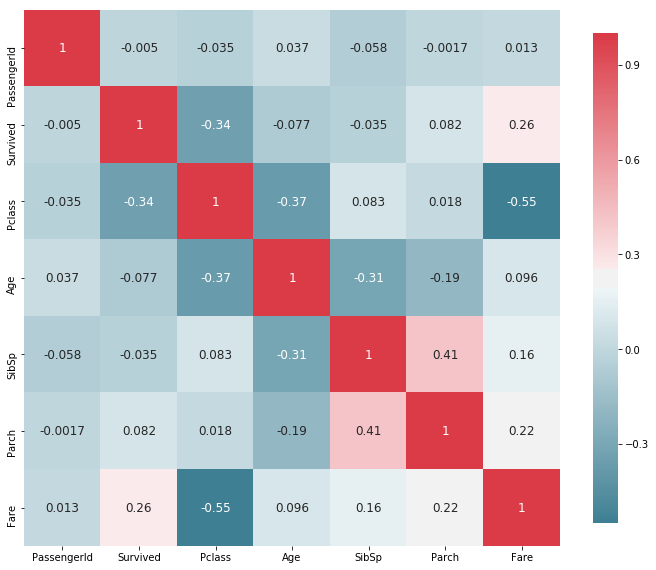


```python
plot_distribution( train , var = 'Age' , target = 'Survived' , row = 'Sex' )
```


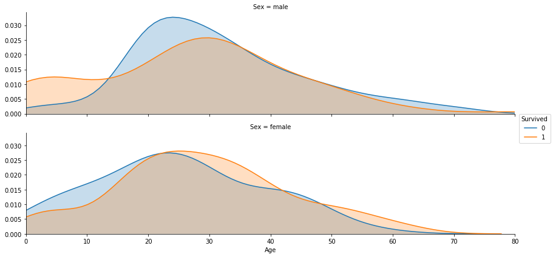


```python
plot_distribution( train , var = 'Fare' , target = 'Survived' , row = 'Sex' )
```


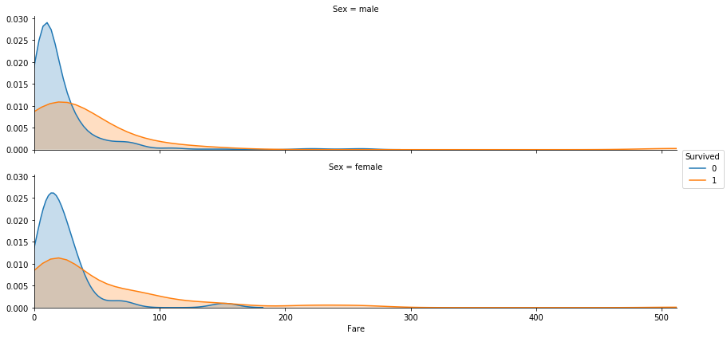


```python
plot_categories( train , cat = 'Embarked' , target = 'Survived' )
```

    /hdd/home/superdanby/Github/Kaggle/venv/lib/python3.6/site-packages/seaborn/axisgrid.py:703: UserWarning: Using the barplot function without specifying `order` is likely to produce an incorrect plot.
      warnings.warn(warning)


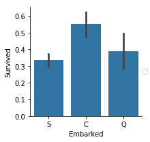


```python
plot_categories( train , cat = 'Cabin' , target = 'Survived' )
```

    /hdd/home/superdanby/Github/Kaggle/venv/lib/python3.6/site-packages/seaborn/axisgrid.py:703: UserWarning: Using the barplot function without specifying `order` is likely to produce an incorrect plot.
      warnings.warn(warning)


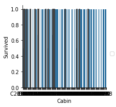


```python
plot_categories( train , cat = 'Parch' , target = 'Survived' )
```

    /hdd/home/superdanby/Github/Kaggle/venv/lib/python3.6/site-packages/seaborn/axisgrid.py:703: UserWarning: Using the barplot function without specifying `order` is likely to produce an incorrect plot.
      warnings.warn(warning)


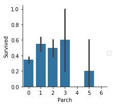


```python
plot_categories( train , cat = 'Pclass' , target = 'Survived' )
```

    /hdd/home/superdanby/Github/Kaggle/venv/lib/python3.6/site-packages/seaborn/axisgrid.py:703: UserWarning: Using the barplot function without specifying `order` is likely to produce an incorrect plot.
      warnings.warn(warning)


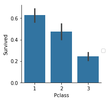


```python
plot_categories( train , cat = 'Sex' , target = 'Survived' )
```

    /hdd/home/superdanby/Github/Kaggle/venv/lib/python3.6/site-packages/seaborn/axisgrid.py:703: UserWarning: Using the barplot function without specifying `order` is likely to produce an incorrect plot.
      warnings.warn(warning)


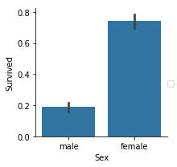


```python
plot_categories( train , cat = 'SibSp' , target = 'Survived' )
```

    /hdd/home/superdanby/Github/Kaggle/venv/lib/python3.6/site-packages/seaborn/axisgrid.py:703: UserWarning: Using the barplot function without specifying `order` is likely to produce an incorrect plot.
      warnings.warn(warning)


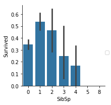


```python
# combine test and train
test['Survived'] = -1
whole = train.append(test, ignore_index = True)
```


```python
# label encoding
```

### 將字串轉成數字型態

```python
le = LabelEncoder()

# dropped = whole.drop(['Name', 'Ticket', 'PassengerId'], axis = 1).iloc[:,:]
dropped = whole.drop(['Name', 'Ticket', 'Cabin', 'PassengerId'], axis = 1).iloc[:,:]

# dropped['Cabin'] = le.fit_transform(dropped['Cabin'].astype(str))

dropped['Embarked'] = le.fit_transform(dropped['Embarked'].astype(str))

dropped['Sex'] = le.fit_transform(dropped['Sex'].astype(str))
```


```python
# NAN

# Fill missing values of Age with the average of Age (mean)
dropped[ 'Age' ] = dropped.Age.fillna( dropped.Age.mean() )

# Fill missing values of Fare with the average of Fare (mean)
dropped[ 'Fare' ] = dropped.Fare.fillna( dropped.Fare.mean() )

# Fill missing values of Parch with the average of Parch (mean)
dropped[ 'Parch' ] = dropped.Parch.fillna( dropped.Parch.mean() )

# Fill missing values of SibSp with the average of SibSp (mean)
dropped[ 'SibSp' ] = dropped.SibSp.fillna( dropped.SibSp.mean() )
```


```python
# separate train data and test data
trle = dropped[dropped['Survived'] != -1]

trle_X = trle.drop(['Survived'], axis = 1)

trle_Y = trle.Survived

tsle = dropped[dropped['Survived'] == -1].drop(['Survived'], axis = 1)
```

### 利用隨機森林選取重要特徵

```python
# feature importance
plot_variable_importance(trle_X, trle_Y)
```

    0.967452300786


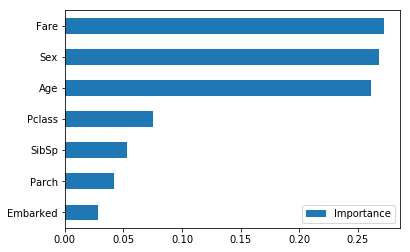

### Model: Random Forest

```python
# RandomForest
param_grid = [{'n_estimators': [10, 50, 100], 'class_weight': [{0:1, 1:1}, 'balanced']},
             ]
RF = GridSearchCV(RandomForestClassifier(), param_grid, verbose = 0, n_jobs = -1, scoring = 'accuracy', cv = StratifiedKFold(5), return_train_score = True)

RF.fit(trle_X, trle_Y)
```


    GridSearchCV(cv=StratifiedKFold(n_splits=5, random_state=None, shuffle=False),
           error_score='raise',
           estimator=RandomForestClassifier(bootstrap=True, class_weight=None, criterion='gini',
                max_depth=None, max_features='auto', max_leaf_nodes=None,
                min_impurity_decrease=0.0, min_impurity_split=None,
                min_samples_leaf=1, min_samples_split=2,
                min_weight_fraction_leaf=0.0, n_estimators=10, n_jobs=1,
                oob_score=False, random_state=None, verbose=0,
                warm_start=False),
           fit_params=None, iid=True, n_jobs=-1,
           param_grid=[{'n_estimators': [10, 50, 100], 'class_weight': [{0: 1, 1: 1}, 'balanced']}],
           pre_dispatch='2*n_jobs', refit=True, return_train_score=True,
           scoring='accuracy', verbose=0)


```python
print('Best Param:', RF.best_params_)

print('Best Model Score:', RF.best_estimator_.score(trle_X, trle_Y))

display(pd.DataFrame(RF.cv_results_))
```

    Best Param: {'class_weight': {0: 1, 1: 1}, 'n_estimators': 100}
    Best Model Score: 0.982042648709


<div>
<style scoped>
    .dataframe tbody tr th:only-of-type {
        vertical-align: middle;
    }

    .dataframe tbody tr th {
        vertical-align: top;
    }

    .dataframe thead th {
        text-align: right;
    }
</style>
<table border="1" class="dataframe">
  <thead>
    <tr style="text-align: right;">
      <th></th>
      <th>mean_fit_time</th>
      <th>mean_score_time</th>
      <th>mean_test_score</th>
      <th>mean_train_score</th>
      <th>param_class_weight</th>
      <th>param_n_estimators</th>
      <th>params</th>
      <th>rank_test_score</th>
      <th>split0_test_score</th>
      <th>split0_train_score</th>
      <th>...</th>
      <th>split2_test_score</th>
      <th>split2_train_score</th>
      <th>split3_test_score</th>
      <th>split3_train_score</th>
      <th>split4_test_score</th>
      <th>split4_train_score</th>
      <th>std_fit_time</th>
      <th>std_score_time</th>
      <th>std_test_score</th>
      <th>std_train_score</th>
    </tr>
  </thead>
  <tbody>
    <tr>
      <th>0</th>
      <td>0.015140</td>
      <td>0.001511</td>
      <td>0.810325</td>
      <td>0.967739</td>
      <td>{0: 1, 1: 1}</td>
      <td>10</td>
      <td>{'class_weight': {0: 1, 1: 1}, 'n_estimators':...</td>
      <td>3</td>
      <td>0.793296</td>
      <td>0.973315</td>
      <td>...</td>
      <td>0.848315</td>
      <td>0.966339</td>
      <td>0.792135</td>
      <td>0.967742</td>
      <td>0.841808</td>
      <td>0.957983</td>
      <td>0.001561</td>
      <td>0.000061</td>
      <td>0.028964</td>
      <td>0.005645</td>
    </tr>
    <tr>
      <th>1</th>
      <td>0.067461</td>
      <td>0.004365</td>
      <td>0.808081</td>
      <td>0.984009</td>
      <td>{0: 1, 1: 1}</td>
      <td>50</td>
      <td>{'class_weight': {0: 1, 1: 1}, 'n_estimators':...</td>
      <td>5</td>
      <td>0.793296</td>
      <td>0.984551</td>
      <td>...</td>
      <td>0.848315</td>
      <td>0.984572</td>
      <td>0.780899</td>
      <td>0.983170</td>
      <td>0.824859</td>
      <td>0.980392</td>
      <td>0.000706</td>
      <td>0.000155</td>
      <td>0.024794</td>
      <td>0.002264</td>
    </tr>
    <tr>
      <th>2</th>
      <td>0.112714</td>
      <td>0.006533</td>
      <td>0.814815</td>
      <td>0.984569</td>
      <td>{0: 1, 1: 1}</td>
      <td>100</td>
      <td>{'class_weight': {0: 1, 1: 1}, 'n_estimators':...</td>
      <td>1</td>
      <td>0.787709</td>
      <td>0.984551</td>
      <td>...</td>
      <td>0.842697</td>
      <td>0.984572</td>
      <td>0.769663</td>
      <td>0.984572</td>
      <td>0.858757</td>
      <td>0.981793</td>
      <td>0.021585</td>
      <td>0.001229</td>
      <td>0.033074</td>
      <td>0.001760</td>
    </tr>
    <tr>
      <th>3</th>
      <td>0.014472</td>
      <td>0.001258</td>
      <td>0.792368</td>
      <td>0.968856</td>
      <td>balanced</td>
      <td>10</td>
      <td>{'class_weight': 'balanced', 'n_estimators': 10}</td>
      <td>6</td>
      <td>0.765363</td>
      <td>0.964888</td>
      <td>...</td>
      <td>0.842697</td>
      <td>0.969144</td>
      <td>0.775281</td>
      <td>0.973352</td>
      <td>0.813559</td>
      <td>0.964986</td>
      <td>0.000152</td>
      <td>0.000039</td>
      <td>0.030767</td>
      <td>0.003474</td>
    </tr>
    <tr>
      <th>4</th>
      <td>0.040834</td>
      <td>0.002599</td>
      <td>0.809203</td>
      <td>0.984569</td>
      <td>balanced</td>
      <td>50</td>
      <td>{'class_weight': 'balanced', 'n_estimators': 50}</td>
      <td>4</td>
      <td>0.787709</td>
      <td>0.984551</td>
      <td>...</td>
      <td>0.848315</td>
      <td>0.984572</td>
      <td>0.780899</td>
      <td>0.984572</td>
      <td>0.824859</td>
      <td>0.981793</td>
      <td>0.002079</td>
      <td>0.000029</td>
      <td>0.024731</td>
      <td>0.001760</td>
    </tr>
    <tr>
      <th>5</th>
      <td>0.078288</td>
      <td>0.004848</td>
      <td>0.814815</td>
      <td>0.984569</td>
      <td>balanced</td>
      <td>100</td>
      <td>{'class_weight': 'balanced', 'n_estimators': 100}</td>
      <td>1</td>
      <td>0.793296</td>
      <td>0.984551</td>
      <td>...</td>
      <td>0.853933</td>
      <td>0.984572</td>
      <td>0.786517</td>
      <td>0.984572</td>
      <td>0.824859</td>
      <td>0.981793</td>
      <td>0.000588</td>
      <td>0.000032</td>
      <td>0.024060</td>
      <td>0.001760</td>
    </tr>
  </tbody>
</table>
<p>6 rows × 22 columns</p>
</div>


```python
# output
tsrf_Y = RF.predict( tsle )

passenger_id = test.PassengerId

tsrf = pd.DataFrame( { 'PassengerId': passenger_id , 'Survived': tsrf_Y } )

tsrf.shape

tsrf.head()

tsrf.to_csv( 'RandomForest.csv' , index = False )
```

### Model: Gradient Boosting

```python
# GradientBoosting
param_grid = [{'loss': ['deviance', 'exponential'], 'n_estimators': [10, 100, 200], 'learning_rate': [0.1, 0.5, 0.9]},
             ]
GBC = GridSearchCV(GradientBoostingClassifier(), param_grid, verbose = 0, n_jobs = -1, scoring = 'accuracy', cv = StratifiedKFold(5), return_train_score = True)

GBC.fit(trle_X, trle_Y)
```


    GridSearchCV(cv=StratifiedKFold(n_splits=5, random_state=None, shuffle=False),
           error_score='raise',
           estimator=GradientBoostingClassifier(criterion='friedman_mse', init=None,
                  learning_rate=0.1, loss='deviance', max_depth=3,
                  max_features=None, max_leaf_nodes=None,
                  min_impurity_decrease=0.0, min_impurity_split=None,
                  min_samples_leaf=1, min_samples_split=2,
                  min_weight_fraction_leaf=0.0, n_estimators=100,
                  presort='auto', random_state=None, subsample=1.0, verbose=0,
                  warm_start=False),
           fit_params=None, iid=True, n_jobs=-1,
           param_grid=[{'loss': ['deviance', 'exponential'], 'n_estimators': [10, 100, 200], 'learning_rate': [0.1, 0.5, 0.9]}],
           pre_dispatch='2*n_jobs', refit=True, return_train_score=True,
           scoring='accuracy', verbose=0)


```python
print('Best Param:', GBC.best_params_)

print('Best Model Score:', GBC.best_estimator_.score(trle_X, trle_Y))

display(pd.DataFrame(GBC.cv_results_))
```

    Best Param: {'learning_rate': 0.1, 'loss': 'exponential', 'n_estimators': 200}
    Best Model Score: 0.910213243547


<div>
<style scoped>
    .dataframe tbody tr th:only-of-type {
        vertical-align: middle;
    }

    .dataframe tbody tr th {
        vertical-align: top;
    }

    .dataframe thead th {
        text-align: right;
    }
</style>
<table border="1" class="dataframe">
  <thead>
    <tr style="text-align: right;">
      <th></th>
      <th>mean_fit_time</th>
      <th>mean_score_time</th>
      <th>mean_test_score</th>
      <th>mean_train_score</th>
      <th>param_learning_rate</th>
      <th>param_loss</th>
      <th>param_n_estimators</th>
      <th>params</th>
      <th>rank_test_score</th>
      <th>split0_test_score</th>
      <th>...</th>
      <th>split2_test_score</th>
      <th>split2_train_score</th>
      <th>split3_test_score</th>
      <th>split3_train_score</th>
      <th>split4_test_score</th>
      <th>split4_train_score</th>
      <th>std_fit_time</th>
      <th>std_score_time</th>
      <th>std_test_score</th>
      <th>std_train_score</th>
    </tr>
  </thead>
  <tbody>
    <tr>
      <th>0</th>
      <td>0.008627</td>
      <td>0.000656</td>
      <td>0.817059</td>
      <td>0.836137</td>
      <td>0.1</td>
      <td>deviance</td>
      <td>10</td>
      <td>{'learning_rate': 0.1, 'loss': 'deviance', 'n_...</td>
      <td>9</td>
      <td>0.810056</td>
      <td>...</td>
      <td>0.820225</td>
      <td>0.840112</td>
      <td>0.792135</td>
      <td>0.842917</td>
      <td>0.847458</td>
      <td>0.834734</td>
      <td>0.000733</td>
      <td>1.136103e-04</td>
      <td>0.017887</td>
      <td>0.004636</td>
    </tr>
    <tr>
      <th>1</th>
      <td>0.059809</td>
      <td>0.000877</td>
      <td>0.827160</td>
      <td>0.905727</td>
      <td>0.1</td>
      <td>deviance</td>
      <td>100</td>
      <td>{'learning_rate': 0.1, 'loss': 'deviance', 'n_...</td>
      <td>2</td>
      <td>0.804469</td>
      <td>...</td>
      <td>0.842697</td>
      <td>0.893408</td>
      <td>0.808989</td>
      <td>0.907433</td>
      <td>0.853107</td>
      <td>0.906162</td>
      <td>0.002474</td>
      <td>9.762651e-05</td>
      <td>0.018746</td>
      <td>0.007570</td>
    </tr>
    <tr>
      <th>2</th>
      <td>0.113517</td>
      <td>0.000908</td>
      <td>0.826038</td>
      <td>0.932384</td>
      <td>0.1</td>
      <td>deviance</td>
      <td>200</td>
      <td>{'learning_rate': 0.1, 'loss': 'deviance', 'n_...</td>
      <td>4</td>
      <td>0.810056</td>
      <td>...</td>
      <td>0.837079</td>
      <td>0.927069</td>
      <td>0.814607</td>
      <td>0.932679</td>
      <td>0.841808</td>
      <td>0.927171</td>
      <td>0.004642</td>
      <td>1.410162e-04</td>
      <td>0.012300</td>
      <td>0.005589</td>
    </tr>
    <tr>
      <th>3</th>
      <td>0.007944</td>
      <td>0.000501</td>
      <td>0.811448</td>
      <td>0.831934</td>
      <td>0.1</td>
      <td>exponential</td>
      <td>10</td>
      <td>{'learning_rate': 0.1, 'loss': 'exponential', ...</td>
      <td>11</td>
      <td>0.810056</td>
      <td>...</td>
      <td>0.814607</td>
      <td>0.837307</td>
      <td>0.786517</td>
      <td>0.840112</td>
      <td>0.830508</td>
      <td>0.819328</td>
      <td>0.000096</td>
      <td>6.370487e-05</td>
      <td>0.014222</td>
      <td>0.007143</td>
    </tr>
    <tr>
      <th>4</th>
      <td>0.049367</td>
      <td>0.000530</td>
      <td>0.821549</td>
      <td>0.894502</td>
      <td>0.1</td>
      <td>exponential</td>
      <td>100</td>
      <td>{'learning_rate': 0.1, 'loss': 'exponential', ...</td>
      <td>6</td>
      <td>0.804469</td>
      <td>...</td>
      <td>0.837079</td>
      <td>0.887798</td>
      <td>0.797753</td>
      <td>0.896213</td>
      <td>0.847458</td>
      <td>0.894958</td>
      <td>0.009087</td>
      <td>8.464382e-05</td>
      <td>0.018796</td>
      <td>0.006709</td>
    </tr>
    <tr>
      <th>5</th>
      <td>0.083615</td>
      <td>0.000708</td>
      <td>0.828283</td>
      <td>0.925085</td>
      <td>0.1</td>
      <td>exponential</td>
      <td>200</td>
      <td>{'learning_rate': 0.1, 'loss': 'exponential', ...</td>
      <td>1</td>
      <td>0.804469</td>
      <td>...</td>
      <td>0.853933</td>
      <td>0.917251</td>
      <td>0.814607</td>
      <td>0.928471</td>
      <td>0.836158</td>
      <td>0.925770</td>
      <td>0.000728</td>
      <td>2.132832e-05</td>
      <td>0.017276</td>
      <td>0.004386</td>
    </tr>
    <tr>
      <th>6</th>
      <td>0.004666</td>
      <td>0.000282</td>
      <td>0.827160</td>
      <td>0.878507</td>
      <td>0.5</td>
      <td>deviance</td>
      <td>10</td>
      <td>{'learning_rate': 0.5, 'loss': 'deviance', 'n_...</td>
      <td>2</td>
      <td>0.798883</td>
      <td>...</td>
      <td>0.865169</td>
      <td>0.870968</td>
      <td>0.814607</td>
      <td>0.886396</td>
      <td>0.841808</td>
      <td>0.878151</td>
      <td>0.000045</td>
      <td>9.368364e-07</td>
      <td>0.023452</td>
      <td>0.004903</td>
    </tr>
    <tr>
      <th>7</th>
      <td>0.039287</td>
      <td>0.000497</td>
      <td>0.820426</td>
      <td>0.971380</td>
      <td>0.5</td>
      <td>deviance</td>
      <td>100</td>
      <td>{'learning_rate': 0.5, 'loss': 'deviance', 'n_...</td>
      <td>7</td>
      <td>0.810056</td>
      <td>...</td>
      <td>0.837079</td>
      <td>0.978962</td>
      <td>0.808989</td>
      <td>0.970547</td>
      <td>0.824859</td>
      <td>0.969188</td>
      <td>0.000260</td>
      <td>1.607938e-05</td>
      <td>0.010352</td>
      <td>0.004223</td>
    </tr>
    <tr>
      <th>8</th>
      <td>0.083753</td>
      <td>0.000732</td>
      <td>0.801347</td>
      <td>0.982887</td>
      <td>0.5</td>
      <td>deviance</td>
      <td>200</td>
      <td>{'learning_rate': 0.5, 'loss': 'deviance', 'n_...</td>
      <td>17</td>
      <td>0.793296</td>
      <td>...</td>
      <td>0.803371</td>
      <td>0.981767</td>
      <td>0.803371</td>
      <td>0.983170</td>
      <td>0.802260</td>
      <td>0.978992</td>
      <td>0.010451</td>
      <td>1.234262e-05</td>
      <td>0.004097</td>
      <td>0.002395</td>
    </tr>
    <tr>
      <th>9</th>
      <td>0.004879</td>
      <td>0.000266</td>
      <td>0.806958</td>
      <td>0.859988</td>
      <td>0.5</td>
      <td>exponential</td>
      <td>10</td>
      <td>{'learning_rate': 0.5, 'loss': 'exponential', ...</td>
      <td>15</td>
      <td>0.765363</td>
      <td>...</td>
      <td>0.820225</td>
      <td>0.852735</td>
      <td>0.786517</td>
      <td>0.868163</td>
      <td>0.841808</td>
      <td>0.861345</td>
      <td>0.000085</td>
      <td>4.380678e-06</td>
      <td>0.027357</td>
      <td>0.005450</td>
    </tr>
    <tr>
      <th>10</th>
      <td>0.042231</td>
      <td>0.000484</td>
      <td>0.819304</td>
      <td>0.964369</td>
      <td>0.5</td>
      <td>exponential</td>
      <td>100</td>
      <td>{'learning_rate': 0.5, 'loss': 'exponential', ...</td>
      <td>8</td>
      <td>0.787709</td>
      <td>...</td>
      <td>0.837079</td>
      <td>0.967742</td>
      <td>0.831461</td>
      <td>0.959327</td>
      <td>0.830508</td>
      <td>0.959384</td>
      <td>0.000279</td>
      <td>8.781575e-06</td>
      <td>0.018311</td>
      <td>0.004189</td>
    </tr>
    <tr>
      <th>11</th>
      <td>0.084677</td>
      <td>0.000713</td>
      <td>0.808081</td>
      <td>0.980641</td>
      <td>0.5</td>
      <td>exponential</td>
      <td>200</td>
      <td>{'learning_rate': 0.5, 'loss': 'exponential', ...</td>
      <td>14</td>
      <td>0.798883</td>
      <td>...</td>
      <td>0.814607</td>
      <td>0.983170</td>
      <td>0.814607</td>
      <td>0.978962</td>
      <td>0.807910</td>
      <td>0.977591</td>
      <td>0.000837</td>
      <td>1.452484e-05</td>
      <td>0.006053</td>
      <td>0.002046</td>
    </tr>
    <tr>
      <th>12</th>
      <td>0.004554</td>
      <td>0.000281</td>
      <td>0.813692</td>
      <td>0.888887</td>
      <td>0.9</td>
      <td>deviance</td>
      <td>10</td>
      <td>{'learning_rate': 0.9, 'loss': 'deviance', 'n_...</td>
      <td>10</td>
      <td>0.765363</td>
      <td>...</td>
      <td>0.825843</td>
      <td>0.877980</td>
      <td>0.820225</td>
      <td>0.894811</td>
      <td>0.841808</td>
      <td>0.894958</td>
      <td>0.000053</td>
      <td>1.762363e-06</td>
      <td>0.025789</td>
      <td>0.006205</td>
    </tr>
    <tr>
      <th>13</th>
      <td>0.047820</td>
      <td>0.000604</td>
      <td>0.801347</td>
      <td>0.980642</td>
      <td>0.9</td>
      <td>deviance</td>
      <td>100</td>
      <td>{'learning_rate': 0.9, 'loss': 'deviance', 'n_...</td>
      <td>17</td>
      <td>0.782123</td>
      <td>...</td>
      <td>0.803371</td>
      <td>0.974755</td>
      <td>0.814607</td>
      <td>0.983170</td>
      <td>0.807910</td>
      <td>0.978992</td>
      <td>0.010435</td>
      <td>1.388222e-04</td>
      <td>0.010953</td>
      <td>0.003797</td>
    </tr>
    <tr>
      <th>14</th>
      <td>0.079258</td>
      <td>0.000751</td>
      <td>0.809203</td>
      <td>0.984569</td>
      <td>0.9</td>
      <td>deviance</td>
      <td>200</td>
      <td>{'learning_rate': 0.9, 'loss': 'deviance', 'n_...</td>
      <td>13</td>
      <td>0.787709</td>
      <td>...</td>
      <td>0.842697</td>
      <td>0.984572</td>
      <td>0.814607</td>
      <td>0.984572</td>
      <td>0.813559</td>
      <td>0.981793</td>
      <td>0.000171</td>
      <td>8.458451e-06</td>
      <td>0.020478</td>
      <td>0.001760</td>
    </tr>
    <tr>
      <th>15</th>
      <td>0.004829</td>
      <td>0.000265</td>
      <td>0.826038</td>
      <td>0.880467</td>
      <td>0.9</td>
      <td>exponential</td>
      <td>10</td>
      <td>{'learning_rate': 0.9, 'loss': 'exponential', ...</td>
      <td>4</td>
      <td>0.826816</td>
      <td>...</td>
      <td>0.831461</td>
      <td>0.872370</td>
      <td>0.797753</td>
      <td>0.890603</td>
      <td>0.836158</td>
      <td>0.886555</td>
      <td>0.000071</td>
      <td>1.257983e-06</td>
      <td>0.014658</td>
      <td>0.007129</td>
    </tr>
    <tr>
      <th>16</th>
      <td>0.042412</td>
      <td>0.000487</td>
      <td>0.804714</td>
      <td>0.980361</td>
      <td>0.9</td>
      <td>exponential</td>
      <td>100</td>
      <td>{'learning_rate': 0.9, 'loss': 'exponential', ...</td>
      <td>16</td>
      <td>0.782123</td>
      <td>...</td>
      <td>0.837079</td>
      <td>0.978962</td>
      <td>0.803371</td>
      <td>0.981767</td>
      <td>0.796610</td>
      <td>0.976190</td>
      <td>0.000302</td>
      <td>5.635965e-06</td>
      <td>0.018034</td>
      <td>0.002490</td>
    </tr>
    <tr>
      <th>17</th>
      <td>0.085332</td>
      <td>0.000712</td>
      <td>0.810325</td>
      <td>0.984569</td>
      <td>0.9</td>
      <td>exponential</td>
      <td>200</td>
      <td>{'learning_rate': 0.9, 'loss': 'exponential', ...</td>
      <td>12</td>
      <td>0.804469</td>
      <td>...</td>
      <td>0.825843</td>
      <td>0.984572</td>
      <td>0.803371</td>
      <td>0.984572</td>
      <td>0.807910</td>
      <td>0.981793</td>
      <td>0.000495</td>
      <td>2.220259e-05</td>
      <td>0.008114</td>
      <td>0.001760</td>
    </tr>
  </tbody>
</table>
<p>18 rows × 23 columns</p>
</div>


```python
# output
tsgbc_Y = GBC.predict( tsle )

passenger_id = test.PassengerId

tsgbc = pd.DataFrame( { 'PassengerId': passenger_id , 'Survived': tsgbc_Y } )

tsgbc.shape

tsgbc.head()

tsgbc.to_csv( 'GradientBoost.csv' , index = False )
```

### Model: Logistic Regression

```python
# LogisticRegression
param_grid = [{'penalty': ['l1'], 'C': [0.1, 1, 10], 'solver': ['liblinear', 'saga'], 'class_weight': [{0:1, 1:1}, 'balanced']},
              {'penalty': ['l2'], 'C': [0.1, 1, 10], 'solver': ['newton-cg', 'sag', 'lbfgs'], 'class_weight': [{0:1, 1:1}, 'balanced']},
             ]
LR = GridSearchCV(LogisticRegression(), param_grid, verbose = 0, n_jobs = -1, scoring = 'accuracy', cv = StratifiedKFold(5), return_train_score = True)

LR.fit(trle_X, trle_Y)
    GridSearchCV(cv=StratifiedKFold(n_splits=5, random_state=None, shuffle=False),
           error_score='raise',
           estimator=LogisticRegression(C=1.0, class_weight=None, dual=False, fit_intercept=True,
              intercept_scaling=1, max_iter=100, multi_class='ovr', n_jobs=1,
              penalty='l2', random_state=None, solver='liblinear', tol=0.0001,
              verbose=0, warm_start=False),
           fit_params=None, iid=True, n_jobs=-1,
           param_grid=[{'penalty': ['l1'], 'C': [0.1, 1, 10], 'solver': ['liblinear', 'saga'], 'class_weight': [{0: 1, 1: 1}, 'balanced']}, {'penalty': ['l2'], 'C': [0.1, 1, 10], 'solver': ['newton-cg', 'sag', 'lbfgs'], 'class_weight': [{0: 1, 1: 1}, 'balanced']}],
           pre_dispatch='2*n_jobs', refit=True, return_train_score=True,
           scoring='accuracy', verbose=0)


```python
print('Best Param:', LR.best_params_)

print('Best Model Score:', LR.best_estimator_.score(trle_X, trle_Y))

display(pd.DataFrame(LR.cv_results_))
```

    Best Param: {'C': 0.1, 'class_weight': {0: 1, 1: 1}, 'penalty': 'l1', 'solver': 'liblinear'}
    Best Model Score: 0.792368125701


<div>
<style scoped>
    .dataframe tbody tr th:only-of-type {
        vertical-align: middle;
    }

    .dataframe tbody tr th {
        vertical-align: top;
    }

    .dataframe thead th {
        text-align: right;
    }
</style>
<table border="1" class="dataframe">
  <thead>
    <tr style="text-align: right;">
      <th></th>
      <th>mean_fit_time</th>
      <th>mean_score_time</th>
      <th>mean_test_score</th>
      <th>mean_train_score</th>
      <th>param_C</th>
      <th>param_class_weight</th>
      <th>param_penalty</th>
      <th>param_solver</th>
      <th>params</th>
      <th>rank_test_score</th>
      <th>...</th>
      <th>split2_test_score</th>
      <th>split2_train_score</th>
      <th>split3_test_score</th>
      <th>split3_train_score</th>
      <th>split4_test_score</th>
      <th>split4_train_score</th>
      <th>std_fit_time</th>
      <th>std_score_time</th>
      <th>std_test_score</th>
      <th>std_train_score</th>
    </tr>
  </thead>
  <tbody>
    <tr>
      <th>0</th>
      <td>0.004839</td>
      <td>0.000484</td>
      <td>0.794613</td>
      <td>0.791249</td>
      <td>0.1</td>
      <td>{0: 1, 1: 1}</td>
      <td>l1</td>
      <td>liblinear</td>
      <td>{'C': 0.1, 'class_weight': {0: 1, 1: 1}, 'pena...</td>
      <td>1</td>
      <td>...</td>
      <td>0.786517</td>
      <td>0.796634</td>
      <td>0.764045</td>
      <td>0.793829</td>
      <td>0.807910</td>
      <td>0.781513</td>
      <td>0.000521</td>
      <td>0.000081</td>
      <td>0.017387</td>
      <td>0.005138</td>
    </tr>
    <tr>
      <th>1</th>
      <td>0.021139</td>
      <td>0.000424</td>
      <td>0.691358</td>
      <td>0.690801</td>
      <td>0.1</td>
      <td>{0: 1, 1: 1}</td>
      <td>l1</td>
      <td>saga</td>
      <td>{'C': 0.1, 'class_weight': {0: 1, 1: 1}, 'pena...</td>
      <td>24</td>
      <td>...</td>
      <td>0.679775</td>
      <td>0.705470</td>
      <td>0.691011</td>
      <td>0.687237</td>
      <td>0.706215</td>
      <td>0.677871</td>
      <td>0.003696</td>
      <td>0.000112</td>
      <td>0.031265</td>
      <td>0.016399</td>
    </tr>
    <tr>
      <th>2</th>
      <td>0.004097</td>
      <td>0.000411</td>
      <td>0.780022</td>
      <td>0.781985</td>
      <td>0.1</td>
      <td>balanced</td>
      <td>l1</td>
      <td>liblinear</td>
      <td>{'C': 0.1, 'class_weight': 'balanced', 'penalt...</td>
      <td>12</td>
      <td>...</td>
      <td>0.775281</td>
      <td>0.784011</td>
      <td>0.752809</td>
      <td>0.792426</td>
      <td>0.796610</td>
      <td>0.778711</td>
      <td>0.000569</td>
      <td>0.000029</td>
      <td>0.023331</td>
      <td>0.005916</td>
    </tr>
    <tr>
      <th>3</th>
      <td>0.018132</td>
      <td>0.000366</td>
      <td>0.690236</td>
      <td>0.691645</td>
      <td>0.1</td>
      <td>balanced</td>
      <td>l1</td>
      <td>saga</td>
      <td>{'C': 0.1, 'class_weight': 'balanced', 'penalt...</td>
      <td>25</td>
      <td>...</td>
      <td>0.702247</td>
      <td>0.687237</td>
      <td>0.730337</td>
      <td>0.685835</td>
      <td>0.717514</td>
      <td>0.684874</td>
      <td>0.003424</td>
      <td>0.000047</td>
      <td>0.058369</td>
      <td>0.011648</td>
    </tr>
    <tr>
      <th>4</th>
      <td>0.003667</td>
      <td>0.000255</td>
      <td>0.786756</td>
      <td>0.803312</td>
      <td>1</td>
      <td>{0: 1, 1: 1}</td>
      <td>l1</td>
      <td>liblinear</td>
      <td>{'C': 1, 'class_weight': {0: 1, 1: 1}, 'penalt...</td>
      <td>2</td>
      <td>...</td>
      <td>0.780899</td>
      <td>0.802244</td>
      <td>0.764045</td>
      <td>0.806452</td>
      <td>0.824859</td>
      <td>0.799720</td>
      <td>0.000169</td>
      <td>0.000023</td>
      <td>0.020172</td>
      <td>0.003153</td>
    </tr>
    <tr>
      <th>5</th>
      <td>0.013572</td>
      <td>0.000293</td>
      <td>0.690236</td>
      <td>0.689118</td>
      <td>1</td>
      <td>{0: 1, 1: 1}</td>
      <td>l1</td>
      <td>saga</td>
      <td>{'C': 1, 'class_weight': {0: 1, 1: 1}, 'penalt...</td>
      <td>25</td>
      <td>...</td>
      <td>0.674157</td>
      <td>0.702665</td>
      <td>0.685393</td>
      <td>0.684432</td>
      <td>0.711864</td>
      <td>0.676471</td>
      <td>0.000265</td>
      <td>0.000008</td>
      <td>0.032486</td>
      <td>0.015138</td>
    </tr>
    <tr>
      <th>6</th>
      <td>0.003973</td>
      <td>0.000249</td>
      <td>0.778900</td>
      <td>0.789845</td>
      <td>1</td>
      <td>balanced</td>
      <td>l1</td>
      <td>liblinear</td>
      <td>{'C': 1, 'class_weight': 'balanced', 'penalty'...</td>
      <td>13</td>
      <td>...</td>
      <td>0.780899</td>
      <td>0.786816</td>
      <td>0.764045</td>
      <td>0.795231</td>
      <td>0.796610</td>
      <td>0.784314</td>
      <td>0.000184</td>
      <td>0.000020</td>
      <td>0.010461</td>
      <td>0.003868</td>
    </tr>
    <tr>
      <th>7</th>
      <td>0.018356</td>
      <td>0.000398</td>
      <td>0.694725</td>
      <td>0.696134</td>
      <td>1</td>
      <td>balanced</td>
      <td>l1</td>
      <td>saga</td>
      <td>{'C': 1, 'class_weight': 'balanced', 'penalty'...</td>
      <td>19</td>
      <td>...</td>
      <td>0.707865</td>
      <td>0.694250</td>
      <td>0.747191</td>
      <td>0.687237</td>
      <td>0.723164</td>
      <td>0.690476</td>
      <td>0.003844</td>
      <td>0.000013</td>
      <td>0.063863</td>
      <td>0.011703</td>
    </tr>
    <tr>
      <th>8</th>
      <td>0.004004</td>
      <td>0.000258</td>
      <td>0.784512</td>
      <td>0.802752</td>
      <td>10</td>
      <td>{0: 1, 1: 1}</td>
      <td>l1</td>
      <td>liblinear</td>
      <td>{'C': 10, 'class_weight': {0: 1, 1: 1}, 'penal...</td>
      <td>9</td>
      <td>...</td>
      <td>0.780899</td>
      <td>0.805049</td>
      <td>0.764045</td>
      <td>0.802244</td>
      <td>0.813559</td>
      <td>0.798319</td>
      <td>0.000389</td>
      <td>0.000034</td>
      <td>0.016393</td>
      <td>0.003266</td>
    </tr>
    <tr>
      <th>9</th>
      <td>0.015304</td>
      <td>0.000328</td>
      <td>0.690236</td>
      <td>0.689679</td>
      <td>10</td>
      <td>{0: 1, 1: 1}</td>
      <td>l1</td>
      <td>saga</td>
      <td>{'C': 10, 'class_weight': {0: 1, 1: 1}, 'penal...</td>
      <td>25</td>
      <td>...</td>
      <td>0.679775</td>
      <td>0.702665</td>
      <td>0.685393</td>
      <td>0.683029</td>
      <td>0.711864</td>
      <td>0.679272</td>
      <td>0.003129</td>
      <td>0.000047</td>
      <td>0.033750</td>
      <td>0.015224</td>
    </tr>
    <tr>
      <th>10</th>
      <td>0.005029</td>
      <td>0.000329</td>
      <td>0.775533</td>
      <td>0.792089</td>
      <td>10</td>
      <td>balanced</td>
      <td>l1</td>
      <td>liblinear</td>
      <td>{'C': 10, 'class_weight': 'balanced', 'penalty...</td>
      <td>14</td>
      <td>...</td>
      <td>0.786517</td>
      <td>0.789621</td>
      <td>0.758427</td>
      <td>0.798036</td>
      <td>0.796610</td>
      <td>0.787115</td>
      <td>0.000718</td>
      <td>0.000081</td>
      <td>0.013993</td>
      <td>0.003696</td>
    </tr>
    <tr>
      <th>11</th>
      <td>0.017352</td>
      <td>0.000369</td>
      <td>0.694725</td>
      <td>0.696133</td>
      <td>10</td>
      <td>balanced</td>
      <td>l1</td>
      <td>saga</td>
      <td>{'C': 10, 'class_weight': 'balanced', 'penalty...</td>
      <td>19</td>
      <td>...</td>
      <td>0.707865</td>
      <td>0.694250</td>
      <td>0.747191</td>
      <td>0.685835</td>
      <td>0.723164</td>
      <td>0.693277</td>
      <td>0.003883</td>
      <td>0.000057</td>
      <td>0.063863</td>
      <td>0.011183</td>
    </tr>
    <tr>
      <th>12</th>
      <td>0.009852</td>
      <td>0.000267</td>
      <td>0.785634</td>
      <td>0.805838</td>
      <td>0.1</td>
      <td>{0: 1, 1: 1}</td>
      <td>l2</td>
      <td>newton-cg</td>
      <td>{'C': 0.1, 'class_weight': {0: 1, 1: 1}, 'pena...</td>
      <td>4</td>
      <td>...</td>
      <td>0.797753</td>
      <td>0.807854</td>
      <td>0.769663</td>
      <td>0.803647</td>
      <td>0.830508</td>
      <td>0.802521</td>
      <td>0.001032</td>
      <td>0.000015</td>
      <td>0.026374</td>
      <td>0.002446</td>
    </tr>
    <tr>
      <th>13</th>
      <td>0.010501</td>
      <td>0.000285</td>
      <td>0.689113</td>
      <td>0.689118</td>
      <td>0.1</td>
      <td>{0: 1, 1: 1}</td>
      <td>l2</td>
      <td>sag</td>
      <td>{'C': 0.1, 'class_weight': {0: 1, 1: 1}, 'pena...</td>
      <td>30</td>
      <td>...</td>
      <td>0.674157</td>
      <td>0.702665</td>
      <td>0.685393</td>
      <td>0.683029</td>
      <td>0.711864</td>
      <td>0.676471</td>
      <td>0.000056</td>
      <td>0.000016</td>
      <td>0.034170</td>
      <td>0.015643</td>
    </tr>
    <tr>
      <th>14</th>
      <td>0.011271</td>
      <td>0.000252</td>
      <td>0.786756</td>
      <td>0.806400</td>
      <td>0.1</td>
      <td>{0: 1, 1: 1}</td>
      <td>l2</td>
      <td>lbfgs</td>
      <td>{'C': 0.1, 'class_weight': {0: 1, 1: 1}, 'pena...</td>
      <td>2</td>
      <td>...</td>
      <td>0.797753</td>
      <td>0.807854</td>
      <td>0.769663</td>
      <td>0.803647</td>
      <td>0.830508</td>
      <td>0.802521</td>
      <td>0.001561</td>
      <td>0.000014</td>
      <td>0.025100</td>
      <td>0.003284</td>
    </tr>
    <tr>
      <th>15</th>
      <td>0.011643</td>
      <td>0.000279</td>
      <td>0.785634</td>
      <td>0.793773</td>
      <td>0.1</td>
      <td>balanced</td>
      <td>l2</td>
      <td>newton-cg</td>
      <td>{'C': 0.1, 'class_weight': 'balanced', 'penalt...</td>
      <td>4</td>
      <td>...</td>
      <td>0.797753</td>
      <td>0.791024</td>
      <td>0.764045</td>
      <td>0.800842</td>
      <td>0.807910</td>
      <td>0.788515</td>
      <td>0.002656</td>
      <td>0.000045</td>
      <td>0.015496</td>
      <td>0.004161</td>
    </tr>
    <tr>
      <th>16</th>
      <td>0.013642</td>
      <td>0.000308</td>
      <td>0.694725</td>
      <td>0.696415</td>
      <td>0.1</td>
      <td>balanced</td>
      <td>l2</td>
      <td>sag</td>
      <td>{'C': 0.1, 'class_weight': 'balanced', 'penalt...</td>
      <td>19</td>
      <td>...</td>
      <td>0.707865</td>
      <td>0.694250</td>
      <td>0.747191</td>
      <td>0.685835</td>
      <td>0.723164</td>
      <td>0.691877</td>
      <td>0.002555</td>
      <td>0.000050</td>
      <td>0.063863</td>
      <td>0.011010</td>
    </tr>
    <tr>
      <th>17</th>
      <td>0.012742</td>
      <td>0.000281</td>
      <td>0.785634</td>
      <td>0.793773</td>
      <td>0.1</td>
      <td>balanced</td>
      <td>l2</td>
      <td>lbfgs</td>
      <td>{'C': 0.1, 'class_weight': 'balanced', 'penalt...</td>
      <td>4</td>
      <td>...</td>
      <td>0.797753</td>
      <td>0.791024</td>
      <td>0.764045</td>
      <td>0.800842</td>
      <td>0.807910</td>
      <td>0.788515</td>
      <td>0.002305</td>
      <td>0.000074</td>
      <td>0.015496</td>
      <td>0.004161</td>
    </tr>
    <tr>
      <th>18</th>
      <td>0.012533</td>
      <td>0.000293</td>
      <td>0.785634</td>
      <td>0.801630</td>
      <td>1</td>
      <td>{0: 1, 1: 1}</td>
      <td>l2</td>
      <td>newton-cg</td>
      <td>{'C': 1, 'class_weight': {0: 1, 1: 1}, 'penalt...</td>
      <td>4</td>
      <td>...</td>
      <td>0.780899</td>
      <td>0.802244</td>
      <td>0.764045</td>
      <td>0.802244</td>
      <td>0.819209</td>
      <td>0.795518</td>
      <td>0.002613</td>
      <td>0.000041</td>
      <td>0.018069</td>
      <td>0.004436</td>
    </tr>
    <tr>
      <th>19</th>
      <td>0.010670</td>
      <td>0.000372</td>
      <td>0.690236</td>
      <td>0.689398</td>
      <td>1</td>
      <td>{0: 1, 1: 1}</td>
      <td>l2</td>
      <td>sag</td>
      <td>{'C': 1, 'class_weight': {0: 1, 1: 1}, 'penalt...</td>
      <td>25</td>
      <td>...</td>
      <td>0.679775</td>
      <td>0.702665</td>
      <td>0.685393</td>
      <td>0.683029</td>
      <td>0.711864</td>
      <td>0.677871</td>
      <td>0.000188</td>
      <td>0.000040</td>
      <td>0.033750</td>
      <td>0.015425</td>
    </tr>
    <tr>
      <th>20</th>
      <td>0.012435</td>
      <td>0.000270</td>
      <td>0.785634</td>
      <td>0.801630</td>
      <td>1</td>
      <td>{0: 1, 1: 1}</td>
      <td>l2</td>
      <td>lbfgs</td>
      <td>{'C': 1, 'class_weight': {0: 1, 1: 1}, 'penalt...</td>
      <td>4</td>
      <td>...</td>
      <td>0.780899</td>
      <td>0.802244</td>
      <td>0.764045</td>
      <td>0.802244</td>
      <td>0.819209</td>
      <td>0.795518</td>
      <td>0.000897</td>
      <td>0.000010</td>
      <td>0.018069</td>
      <td>0.004436</td>
    </tr>
    <tr>
      <th>21</th>
      <td>0.012769</td>
      <td>0.000264</td>
      <td>0.775533</td>
      <td>0.794617</td>
      <td>1</td>
      <td>balanced</td>
      <td>l2</td>
      <td>newton-cg</td>
      <td>{'C': 1, 'class_weight': 'balanced', 'penalty'...</td>
      <td>14</td>
      <td>...</td>
      <td>0.786517</td>
      <td>0.792426</td>
      <td>0.758427</td>
      <td>0.798036</td>
      <td>0.796610</td>
      <td>0.787115</td>
      <td>0.001360</td>
      <td>0.000023</td>
      <td>0.013993</td>
      <td>0.004652</td>
    </tr>
    <tr>
      <th>22</th>
      <td>0.011722</td>
      <td>0.000321</td>
      <td>0.694725</td>
      <td>0.696133</td>
      <td>1</td>
      <td>balanced</td>
      <td>l2</td>
      <td>sag</td>
      <td>{'C': 1, 'class_weight': 'balanced', 'penalty'...</td>
      <td>19</td>
      <td>...</td>
      <td>0.707865</td>
      <td>0.694250</td>
      <td>0.747191</td>
      <td>0.685835</td>
      <td>0.723164</td>
      <td>0.693277</td>
      <td>0.002423</td>
      <td>0.000047</td>
      <td>0.063863</td>
      <td>0.011183</td>
    </tr>
    <tr>
      <th>23</th>
      <td>0.014138</td>
      <td>0.000291</td>
      <td>0.775533</td>
      <td>0.794617</td>
      <td>1</td>
      <td>balanced</td>
      <td>l2</td>
      <td>lbfgs</td>
      <td>{'C': 1, 'class_weight': 'balanced', 'penalty'...</td>
      <td>14</td>
      <td>...</td>
      <td>0.786517</td>
      <td>0.792426</td>
      <td>0.758427</td>
      <td>0.798036</td>
      <td>0.796610</td>
      <td>0.787115</td>
      <td>0.002429</td>
      <td>0.000056</td>
      <td>0.013993</td>
      <td>0.004652</td>
    </tr>
    <tr>
      <th>24</th>
      <td>0.011371</td>
      <td>0.000252</td>
      <td>0.784512</td>
      <td>0.803032</td>
      <td>10</td>
      <td>{0: 1, 1: 1}</td>
      <td>l2</td>
      <td>newton-cg</td>
      <td>{'C': 10, 'class_weight': {0: 1, 1: 1}, 'penal...</td>
      <td>9</td>
      <td>...</td>
      <td>0.780899</td>
      <td>0.805049</td>
      <td>0.764045</td>
      <td>0.802244</td>
      <td>0.813559</td>
      <td>0.799720</td>
      <td>0.002135</td>
      <td>0.000065</td>
      <td>0.016393</td>
      <td>0.002915</td>
    </tr>
    <tr>
      <th>25</th>
      <td>0.012640</td>
      <td>0.000331</td>
      <td>0.690236</td>
      <td>0.689398</td>
      <td>10</td>
      <td>{0: 1, 1: 1}</td>
      <td>l2</td>
      <td>sag</td>
      <td>{'C': 10, 'class_weight': {0: 1, 1: 1}, 'penal...</td>
      <td>25</td>
      <td>...</td>
      <td>0.679775</td>
      <td>0.702665</td>
      <td>0.685393</td>
      <td>0.683029</td>
      <td>0.711864</td>
      <td>0.677871</td>
      <td>0.002333</td>
      <td>0.000045</td>
      <td>0.033750</td>
      <td>0.015425</td>
    </tr>
    <tr>
      <th>26</th>
      <td>0.011121</td>
      <td>0.000267</td>
      <td>0.784512</td>
      <td>0.803032</td>
      <td>10</td>
      <td>{0: 1, 1: 1}</td>
      <td>l2</td>
      <td>lbfgs</td>
      <td>{'C': 10, 'class_weight': {0: 1, 1: 1}, 'penal...</td>
      <td>9</td>
      <td>...</td>
      <td>0.780899</td>
      <td>0.805049</td>
      <td>0.764045</td>
      <td>0.802244</td>
      <td>0.813559</td>
      <td>0.799720</td>
      <td>0.001226</td>
      <td>0.000013</td>
      <td>0.016393</td>
      <td>0.002915</td>
    </tr>
    <tr>
      <th>27</th>
      <td>0.013278</td>
      <td>0.000293</td>
      <td>0.775533</td>
      <td>0.792931</td>
      <td>10</td>
      <td>balanced</td>
      <td>l2</td>
      <td>newton-cg</td>
      <td>{'C': 10, 'class_weight': 'balanced', 'penalty...</td>
      <td>14</td>
      <td>...</td>
      <td>0.786517</td>
      <td>0.789621</td>
      <td>0.758427</td>
      <td>0.799439</td>
      <td>0.796610</td>
      <td>0.788515</td>
      <td>0.002504</td>
      <td>0.000037</td>
      <td>0.013993</td>
      <td>0.003835</td>
    </tr>
    <tr>
      <th>28</th>
      <td>0.014154</td>
      <td>0.000320</td>
      <td>0.694725</td>
      <td>0.696695</td>
      <td>10</td>
      <td>balanced</td>
      <td>l2</td>
      <td>sag</td>
      <td>{'C': 10, 'class_weight': 'balanced', 'penalty...</td>
      <td>19</td>
      <td>...</td>
      <td>0.707865</td>
      <td>0.694250</td>
      <td>0.747191</td>
      <td>0.685835</td>
      <td>0.723164</td>
      <td>0.693277</td>
      <td>0.002932</td>
      <td>0.000047</td>
      <td>0.063863</td>
      <td>0.010909</td>
    </tr>
    <tr>
      <th>29</th>
      <td>0.013745</td>
      <td>0.000306</td>
      <td>0.775533</td>
      <td>0.792931</td>
      <td>10</td>
      <td>balanced</td>
      <td>l2</td>
      <td>lbfgs</td>
      <td>{'C': 10, 'class_weight': 'balanced', 'penalty...</td>
      <td>14</td>
      <td>...</td>
      <td>0.786517</td>
      <td>0.789621</td>
      <td>0.758427</td>
      <td>0.799439</td>
      <td>0.796610</td>
      <td>0.788515</td>
      <td>0.002054</td>
      <td>0.000046</td>
      <td>0.013993</td>
      <td>0.003835</td>
    </tr>
  </tbody>
</table>
<p>30 rows × 24 columns</p>
</div>


```python
# output
tsLR_Y = LR.predict( tsle )

passenger_id = test.PassengerId

tsLR = pd.DataFrame( { 'PassengerId': passenger_id , 'Survived': tsLR_Y } )

tsLR.shape

tsLR.head()

tsLR.to_csv( 'LogisticRegression.csv' , index = False )
```

### One Hot Encoding 解決 Categorial Features

```python
# get numerical features
numerical = pd.DataFrame()

# Fill missing values of Age with the average of Age (mean)
numerical[ 'Age' ] = whole.Age.fillna( whole.Age.mean() )

# Fill missing values of Fare with the average of Fare (mean)
numerical[ 'Fare' ] = whole.Fare.fillna( whole.Fare.mean() )

# Fill missing values of Parch with the average of Parch (mean)
numerical[ 'Parch' ] = whole.Parch.fillna( whole.Parch.mean() )

# Fill missing values of SibSp with the average of SibSp (mean)
numerical[ 'SibSp' ] = whole.SibSp.fillna( whole.SibSp.mean() )

numerical.head()
```


<div>
<style scoped>
    .dataframe tbody tr th:only-of-type {
        vertical-align: middle;
    }

    .dataframe tbody tr th {
        vertical-align: top;
    }

    .dataframe thead th {
        text-align: right;
    }
</style>
<table border="1" class="dataframe">
  <thead>
    <tr style="text-align: right;">
      <th></th>
      <th>Age</th>
      <th>Fare</th>
      <th>Parch</th>
      <th>SibSp</th>
    </tr>
  </thead>
  <tbody>
    <tr>
      <th>0</th>
      <td>22.0</td>
      <td>7.2500</td>
      <td>0</td>
      <td>1</td>
    </tr>
    <tr>
      <th>1</th>
      <td>38.0</td>
      <td>71.2833</td>
      <td>0</td>
      <td>1</td>
    </tr>
    <tr>
      <th>2</th>
      <td>26.0</td>
      <td>7.9250</td>
      <td>0</td>
      <td>0</td>
    </tr>
    <tr>
      <th>3</th>
      <td>35.0</td>
      <td>53.1000</td>
      <td>0</td>
      <td>1</td>
    </tr>
    <tr>
      <th>4</th>
      <td>35.0</td>
      <td>8.0500</td>
      <td>0</td>
      <td>0</td>
    </tr>
  </tbody>
</table>
</div>


```python
# get categorial features
cabin = pd.DataFrame()

# replacing missing cabins with U (for Uknown)
cabin[ 'Cabin' ] = whole.Cabin.fillna( 'Unknown' )

# dummy encoding ...
cabin = pd.get_dummies( cabin['Cabin'] , prefix = 'Cabin' )

cabin.head()
```


<div>
<style scoped>
    .dataframe tbody tr th:only-of-type {
        vertical-align: middle;
    }

    .dataframe tbody tr th {
        vertical-align: top;
    }

    .dataframe thead th {
        text-align: right;
    }
</style>
<table border="1" class="dataframe">
  <thead>
    <tr style="text-align: right;">
      <th></th>
      <th>Cabin_A10</th>
      <th>Cabin_A11</th>
      <th>Cabin_A14</th>
      <th>Cabin_A16</th>
      <th>Cabin_A18</th>
      <th>Cabin_A19</th>
      <th>Cabin_A20</th>
      <th>Cabin_A21</th>
      <th>Cabin_A23</th>
      <th>Cabin_A24</th>
      <th>...</th>
      <th>Cabin_F E69</th>
      <th>Cabin_F G63</th>
      <th>Cabin_F G73</th>
      <th>Cabin_F2</th>
      <th>Cabin_F33</th>
      <th>Cabin_F38</th>
      <th>Cabin_F4</th>
      <th>Cabin_G6</th>
      <th>Cabin_T</th>
      <th>Cabin_Unknown</th>
    </tr>
  </thead>
  <tbody>
    <tr>
      <th>0</th>
      <td>0</td>
      <td>0</td>
      <td>0</td>
      <td>0</td>
      <td>0</td>
      <td>0</td>
      <td>0</td>
      <td>0</td>
      <td>0</td>
      <td>0</td>
      <td>...</td>
      <td>0</td>
      <td>0</td>
      <td>0</td>
      <td>0</td>
      <td>0</td>
      <td>0</td>
      <td>0</td>
      <td>0</td>
      <td>0</td>
      <td>1</td>
    </tr>
    <tr>
      <th>1</th>
      <td>0</td>
      <td>0</td>
      <td>0</td>
      <td>0</td>
      <td>0</td>
      <td>0</td>
      <td>0</td>
      <td>0</td>
      <td>0</td>
      <td>0</td>
      <td>...</td>
      <td>0</td>
      <td>0</td>
      <td>0</td>
      <td>0</td>
      <td>0</td>
      <td>0</td>
      <td>0</td>
      <td>0</td>
      <td>0</td>
      <td>0</td>
    </tr>
    <tr>
      <th>2</th>
      <td>0</td>
      <td>0</td>
      <td>0</td>
      <td>0</td>
      <td>0</td>
      <td>0</td>
      <td>0</td>
      <td>0</td>
      <td>0</td>
      <td>0</td>
      <td>...</td>
      <td>0</td>
      <td>0</td>
      <td>0</td>
      <td>0</td>
      <td>0</td>
      <td>0</td>
      <td>0</td>
      <td>0</td>
      <td>0</td>
      <td>1</td>
    </tr>
    <tr>
      <th>3</th>
      <td>0</td>
      <td>0</td>
      <td>0</td>
      <td>0</td>
      <td>0</td>
      <td>0</td>
      <td>0</td>
      <td>0</td>
      <td>0</td>
      <td>0</td>
      <td>...</td>
      <td>0</td>
      <td>0</td>
      <td>0</td>
      <td>0</td>
      <td>0</td>
      <td>0</td>
      <td>0</td>
      <td>0</td>
      <td>0</td>
      <td>0</td>
    </tr>
    <tr>
      <th>4</th>
      <td>0</td>
      <td>0</td>
      <td>0</td>
      <td>0</td>
      <td>0</td>
      <td>0</td>
      <td>0</td>
      <td>0</td>
      <td>0</td>
      <td>0</td>
      <td>...</td>
      <td>0</td>
      <td>0</td>
      <td>0</td>
      <td>0</td>
      <td>0</td>
      <td>0</td>
      <td>0</td>
      <td>0</td>
      <td>0</td>
      <td>1</td>
    </tr>
  </tbody>
</table>
<p>5 rows × 187 columns</p>
</div>


```python
# get categorial features
embarked = pd.DataFrame()

# replacing missing cabins with U (for Uknown)
embarked[ 'Embarked' ] = whole.Embarked.fillna( 'Unknown' )

# dummy encoding ...
embarked = pd.get_dummies( embarked['Embarked'] , prefix = 'Embarked' )

embarked.head()
```


<div>
<style scoped>
    .dataframe tbody tr th:only-of-type {
        vertical-align: middle;
    }

    .dataframe tbody tr th {
        vertical-align: top;
    }

    .dataframe thead th {
        text-align: right;
    }
</style>
<table border="1" class="dataframe">
  <thead>
    <tr style="text-align: right;">
      <th></th>
      <th>Embarked_C</th>
      <th>Embarked_Q</th>
      <th>Embarked_S</th>
      <th>Embarked_Unknown</th>
    </tr>
  </thead>
  <tbody>
    <tr>
      <th>0</th>
      <td>0</td>
      <td>0</td>
      <td>1</td>
      <td>0</td>
    </tr>
    <tr>
      <th>1</th>
      <td>1</td>
      <td>0</td>
      <td>0</td>
      <td>0</td>
    </tr>
    <tr>
      <th>2</th>
      <td>0</td>
      <td>0</td>
      <td>1</td>
      <td>0</td>
    </tr>
    <tr>
      <th>3</th>
      <td>0</td>
      <td>0</td>
      <td>1</td>
      <td>0</td>
    </tr>
    <tr>
      <th>4</th>
      <td>0</td>
      <td>0</td>
      <td>1</td>
      <td>0</td>
    </tr>
  </tbody>
</table>
</div>


```python
# get categorial features
pclass = pd.DataFrame()

# replacing missing cabins with U (for Uknown)
pclass[ 'Pclass' ] = whole.Pclass.fillna( 'Unknown' )

# dummy encoding ...
pclass = pd.get_dummies( pclass['Pclass'] , prefix = 'Pclass' )

pclass.head()
```


<div>
<style scoped>
    .dataframe tbody tr th:only-of-type {
        vertical-align: middle;
    }

    .dataframe tbody tr th {
        vertical-align: top;
    }

    .dataframe thead th {
        text-align: right;
    }
</style>
<table border="1" class="dataframe">
  <thead>
    <tr style="text-align: right;">
      <th></th>
      <th>Pclass_1</th>
      <th>Pclass_2</th>
      <th>Pclass_3</th>
    </tr>
  </thead>
  <tbody>
    <tr>
      <th>0</th>
      <td>0</td>
      <td>0</td>
      <td>1</td>
    </tr>
    <tr>
      <th>1</th>
      <td>1</td>
      <td>0</td>
      <td>0</td>
    </tr>
    <tr>
      <th>2</th>
      <td>0</td>
      <td>0</td>
      <td>1</td>
    </tr>
    <tr>
      <th>3</th>
      <td>1</td>
      <td>0</td>
      <td>0</td>
    </tr>
    <tr>
      <th>4</th>
      <td>0</td>
      <td>0</td>
      <td>1</td>
    </tr>
  </tbody>
</table>
</div>


```python
# get categorial features
sex = pd.DataFrame()

# replacing missing cabins with U (for Uknown)
sex[ 'Sex' ] = whole.Sex.fillna( 'Unknown' )

# dummy encoding ...
sex = pd.get_dummies( sex['Sex'] , prefix = 'Sex' )

sex.head()
```


<div>
<style scoped>
    .dataframe tbody tr th:only-of-type {
        vertical-align: middle;
    }

    .dataframe tbody tr th {
        vertical-align: top;
    }

    .dataframe thead th {
        text-align: right;
    }
</style>
<table border="1" class="dataframe">
  <thead>
    <tr style="text-align: right;">
      <th></th>
      <th>Sex_female</th>
      <th>Sex_male</th>
    </tr>
  </thead>
  <tbody>
    <tr>
      <th>0</th>
      <td>0</td>
      <td>1</td>
    </tr>
    <tr>
      <th>1</th>
      <td>1</td>
      <td>0</td>
    </tr>
    <tr>
      <th>2</th>
      <td>1</td>
      <td>0</td>
    </tr>
    <tr>
      <th>3</th>
      <td>1</td>
      <td>0</td>
    </tr>
    <tr>
      <th>4</th>
      <td>0</td>
      <td>1</td>
    </tr>
  </tbody>
</table>
</div>


```python
# combine all features
ready = pd.concat([numerical, cabin, pclass, sex, whole.Survived], axis = 1)

ready.head()
```


<div>
<style scoped>
    .dataframe tbody tr th:only-of-type {
        vertical-align: middle;
    }

    .dataframe tbody tr th {
        vertical-align: top;
    }

    .dataframe thead th {
        text-align: right;
    }
</style>
<table border="1" class="dataframe">
  <thead>
    <tr style="text-align: right;">
      <th></th>
      <th>Age</th>
      <th>Fare</th>
      <th>Parch</th>
      <th>SibSp</th>
      <th>Cabin_A10</th>
      <th>Cabin_A11</th>
      <th>Cabin_A14</th>
      <th>Cabin_A16</th>
      <th>Cabin_A18</th>
      <th>Cabin_A19</th>
      <th>...</th>
      <th>Cabin_F4</th>
      <th>Cabin_G6</th>
      <th>Cabin_T</th>
      <th>Cabin_Unknown</th>
      <th>Pclass_1</th>
      <th>Pclass_2</th>
      <th>Pclass_3</th>
      <th>Sex_female</th>
      <th>Sex_male</th>
      <th>Survived</th>
    </tr>
  </thead>
  <tbody>
    <tr>
      <th>0</th>
      <td>22.0</td>
      <td>7.2500</td>
      <td>0</td>
      <td>1</td>
      <td>0</td>
      <td>0</td>
      <td>0</td>
      <td>0</td>
      <td>0</td>
      <td>0</td>
      <td>...</td>
      <td>0</td>
      <td>0</td>
      <td>0</td>
      <td>1</td>
      <td>0</td>
      <td>0</td>
      <td>1</td>
      <td>0</td>
      <td>1</td>
      <td>0</td>
    </tr>
    <tr>
      <th>1</th>
      <td>38.0</td>
      <td>71.2833</td>
      <td>0</td>
      <td>1</td>
      <td>0</td>
      <td>0</td>
      <td>0</td>
      <td>0</td>
      <td>0</td>
      <td>0</td>
      <td>...</td>
      <td>0</td>
      <td>0</td>
      <td>0</td>
      <td>0</td>
      <td>1</td>
      <td>0</td>
      <td>0</td>
      <td>1</td>
      <td>0</td>
      <td>1</td>
    </tr>
    <tr>
      <th>2</th>
      <td>26.0</td>
      <td>7.9250</td>
      <td>0</td>
      <td>0</td>
      <td>0</td>
      <td>0</td>
      <td>0</td>
      <td>0</td>
      <td>0</td>
      <td>0</td>
      <td>...</td>
      <td>0</td>
      <td>0</td>
      <td>0</td>
      <td>1</td>
      <td>0</td>
      <td>0</td>
      <td>1</td>
      <td>1</td>
      <td>0</td>
      <td>1</td>
    </tr>
    <tr>
      <th>3</th>
      <td>35.0</td>
      <td>53.1000</td>
      <td>0</td>
      <td>1</td>
      <td>0</td>
      <td>0</td>
      <td>0</td>
      <td>0</td>
      <td>0</td>
      <td>0</td>
      <td>...</td>
      <td>0</td>
      <td>0</td>
      <td>0</td>
      <td>0</td>
      <td>1</td>
      <td>0</td>
      <td>0</td>
      <td>1</td>
      <td>0</td>
      <td>1</td>
    </tr>
    <tr>
      <th>4</th>
      <td>35.0</td>
      <td>8.0500</td>
      <td>0</td>
      <td>0</td>
      <td>0</td>
      <td>0</td>
      <td>0</td>
      <td>0</td>
      <td>0</td>
      <td>0</td>
      <td>...</td>
      <td>0</td>
      <td>0</td>
      <td>0</td>
      <td>1</td>
      <td>0</td>
      <td>0</td>
      <td>1</td>
      <td>0</td>
      <td>1</td>
      <td>0</td>
    </tr>
  </tbody>
</table>
<p>5 rows × 197 columns</p>
</div>


```python
# separate train data and test data
trohe = ready[ready['Survived'] != -1]

trohe_X = trohe.drop(['Survived'], axis = 1)

trohe_Y = trohe.Survived

tsohe = ready[ready['Survived'] == -1].drop(['Survived'], axis = 1)
```

### 資料正規化

```python
# standardize
sc = StandardScaler()

sc.fit(trohe_X)

trstd_X = sc.transform(trohe_X)

tsstd = sc.transform(tsohe)
```

### 主成份分析

```python
# PCA
pca = PCA(n_components = 0.95)

trpca_X = pca.fit_transform(trstd_X)

tspca = pca.transform(tsstd)

pca.explained_variance_ratio_
```


    array([ 0.02328329,  0.01583371,  0.01158622,  0.00983334,  0.0083634 ,
            0.00803865,  0.00721866,  0.00684796,  0.00639709,  0.00639266,
            0.00639178,  0.00639094,  0.00639093,  0.00639014,  0.00638747,
            0.00638459,  0.00638376,  0.00638376,  0.00638376,  0.00638376,
            0.00638376,  0.00638376,  0.00638376,  0.00638376,  0.00638376,
            0.00638376,  0.00638376,  0.00638376,  0.00638376,  0.00638376,
            0.00638376,  0.00638376,  0.00638376,  0.00638376,  0.00638376,
            0.00638376,  0.00638376,  0.00638376,  0.00638376,  0.00638376,
            0.00638376,  0.00638376,  0.00638376,  0.00638376,  0.00638376,
            0.00638376,  0.00638236,  0.00638215,  0.00638139,  0.00638067,
            0.00638033,  0.00637967,  0.00637867,  0.00637782,  0.00637658,
            0.00637658,  0.00637658,  0.00637658,  0.00637658,  0.00637658,
            0.00637658,  0.00637658,  0.00637658,  0.00637658,  0.00637658,
            0.00637658,  0.00637658,  0.00637658,  0.00637658,  0.00637658,
            0.00637658,  0.00637658,  0.00637658,  0.00637658,  0.00637658,
            0.00637658,  0.00637658,  0.00637658,  0.00637658,  0.00637658,
            0.00637658,  0.00637658,  0.00637658,  0.00637658,  0.00637658,
            0.00637658,  0.00637658,  0.00637658,  0.00637658,  0.00637658,
            0.00637658,  0.00637658,  0.00637658,  0.00637658,  0.00637658,
            0.00637658,  0.00637658,  0.00637658,  0.00637658,  0.00637658,
            0.00637658,  0.00637658,  0.00637658,  0.00637658,  0.00637658,
            0.00637658,  0.00637658,  0.00637658,  0.00637658,  0.00637658,
            0.00637658,  0.00637658,  0.00637658,  0.00637658,  0.00637658,
            0.00637658,  0.00637658,  0.00637658,  0.00637658,  0.00637658,
            0.00637658,  0.00637658,  0.00637658,  0.00637658,  0.00637658,
            0.00637658,  0.00637658,  0.00637658,  0.00637658,  0.00637658,
            0.00637658,  0.00637658,  0.00637658,  0.00637658,  0.00637658,
            0.00637658,  0.00637658,  0.00637658,  0.00637658,  0.00637658,
            0.00637658,  0.00637658,  0.00637658])


```python
cov_mat = np.cov(trstd_X.T)

eigen_vals, eigen_vecs = np.linalg.eig(cov_mat)

print('\nEigenvalues \n%s' % eigen_vals)
```


    Eigenvalues
    [  3.65958401e+00   2.48868588e+00   1.82107991e+00   1.54556867e+00
       1.20120770e-01   2.05148278e-01   3.76339613e-01   4.57377897e-01
       1.31452874e+00   6.80901036e-01   1.26348610e+00   7.93501504e-01
       8.70258505e-01   1.13460346e+00   1.07633704e+00  -1.53652359e-15
       2.87021781e-16  -1.50181553e-16   1.00547180e+00   1.00477483e+00
       1.00463734e+00   1.00395931e+00   1.00437908e+00   1.00450295e+00
       1.00450570e+00   1.00350660e+00   1.00244331e+00   1.00315648e+00
       1.00312270e+00   1.00300417e+00   1.00273391e+00   1.00257593e+00
       1.00283670e+00   1.00289087e+00   1.00224845e+00   1.00224845e+00
       1.00337584e+00   1.00337584e+00   1.00224845e+00   1.00337584e+00
       1.00337584e+00   1.00337584e+00   1.00337584e+00   1.00337584e+00
       1.00337584e+00   1.00224845e+00   1.00224845e+00   1.00224845e+00
       1.00224845e+00   1.00224845e+00   1.00224845e+00   1.00224845e+00
       1.00224845e+00   1.00337584e+00   1.00337584e+00   1.00337584e+00
       1.00337584e+00   1.00337584e+00   1.00224845e+00   1.00224845e+00
       1.00224845e+00   1.00224845e+00   1.00337584e+00   1.00337584e+00
       1.00224845e+00   1.00224845e+00   1.00224845e+00   1.00337584e+00
       1.00337584e+00   1.00337584e+00   1.00337584e+00   1.00337584e+00
       1.00224845e+00   1.00224845e+00   1.00224845e+00   1.00224845e+00
       1.00224845e+00   1.00224845e+00   1.00224845e+00   1.00224845e+00
       1.00224845e+00   1.00224845e+00   1.00224845e+00   1.00337584e+00
       1.00337584e+00   1.00337584e+00   1.00337584e+00   1.00337584e+00
       1.00224845e+00   1.00224845e+00   1.00224845e+00   1.00224845e+00
       1.00224845e+00   1.00224845e+00   1.00224845e+00   1.00224845e+00
       1.00337584e+00   1.00337584e+00   1.00337584e+00   1.00337584e+00
       1.00337584e+00   1.00224845e+00   1.00224845e+00   1.00224845e+00
       1.00224845e+00   1.00224845e+00   1.00224845e+00   1.00224845e+00
       1.00224845e+00   1.00224845e+00   1.00224845e+00   1.00224845e+00
       1.00224845e+00   1.00224845e+00   1.00224845e+00   1.00224845e+00
       1.00224845e+00   1.00224845e+00   1.00224845e+00   1.00224845e+00
       1.00224845e+00   1.00224845e+00   1.00224845e+00   1.00224845e+00
       1.00224845e+00   1.00224845e+00   1.00224845e+00   1.00224845e+00
       1.00224845e+00   1.00224845e+00   1.00224845e+00   1.00224845e+00
       1.00224845e+00   1.00224845e+00   1.00224845e+00   1.00224845e+00
       1.00224845e+00   1.00224845e+00   1.00224845e+00   1.00224845e+00
       1.00224845e+00   1.00224845e+00   1.00224845e+00   1.00224845e+00
       1.00224845e+00   1.00224845e+00   1.00224845e+00   1.00224845e+00
       1.00224845e+00   1.00224845e+00   1.00224845e+00   1.00224845e+00
       1.00224845e+00   1.00224845e+00   1.00224845e+00   1.00224845e+00
       1.00224845e+00   0.00000000e+00   0.00000000e+00   0.00000000e+00
       0.00000000e+00   0.00000000e+00   0.00000000e+00   0.00000000e+00
       0.00000000e+00   0.00000000e+00   0.00000000e+00   0.00000000e+00
       0.00000000e+00   0.00000000e+00   0.00000000e+00   0.00000000e+00
       0.00000000e+00   0.00000000e+00   0.00000000e+00   0.00000000e+00
       0.00000000e+00   0.00000000e+00   0.00000000e+00   0.00000000e+00
       0.00000000e+00   0.00000000e+00   0.00000000e+00   0.00000000e+00
       0.00000000e+00   0.00000000e+00   0.00000000e+00   0.00000000e+00
       0.00000000e+00   0.00000000e+00   0.00000000e+00   0.00000000e+00
       0.00000000e+00   0.00000000e+00   0.00000000e+00   0.00000000e+00]

### 線性判別分析

```python
# LDA
# lda = LinearDiscriminantAnalysis(n_components=10)

# trlda_X = lda.fit_transform(trstd_X, trohe_Y)

# tslda = lda.transform(tsstd)

# lda.explained_variance_ratio_
```

### Model: Support Vector Machine

```python
# SVM
param_grid = [
   {'C': [0.1, 1, 10], 'gamma': ['auto', (1 / 10), 1, 10], 'kernel': ['rbf'], 'class_weight': [{0:1, 1:1}, 'balanced']},
   {'C': [ 0.1, 1, 10], 'kernel': ['poly'], 'class_weight': [{0:1, 1:1}, 'balanced']},
   {'C': [ 0.1, 1, 10], 'kernel': ['sigmoid'], 'class_weight': [{0:1, 1:1}, 'balanced']},
 ]

SVM = GridSearchCV(SVC(), param_grid, verbose = 0, n_jobs = -1, scoring = 'accuracy', cv = StratifiedKFold(5), return_train_score = True)

SVM.fit(trpca_X, trohe_Y)
```


    GridSearchCV(cv=StratifiedKFold(n_splits=5, random_state=None, shuffle=False),
           error_score='raise',
           estimator=SVC(C=1.0, cache_size=200, class_weight=None, coef0=0.0,
      decision_function_shape='ovr', degree=3, gamma='auto', kernel='rbf',
      max_iter=-1, probability=False, random_state=None, shrinking=True,
      tol=0.001, verbose=False),
           fit_params=None, iid=True, n_jobs=-1,
           param_grid=[{'C': [0.1, 1, 10], 'gamma': ['auto', 0.1, 1, 10], 'kernel': ['rbf'], 'class_weight': [{0: 1, 1: 1}, 'balanced']}, {'C': [0.1, 1, 10], 'kernel': ['poly'], 'class_weight': [{0: 1, 1: 1}, 'balanced']}, {'C': [0.1, 1, 10], 'kernel': ['sigmoid'], 'class_weight': [{0: 1, 1: 1}, 'balanced']}],
           pre_dispatch='2*n_jobs', refit=True, return_train_score=True,
           scoring='accuracy', verbose=0)


```python
print('Best Param:', SVM.best_params_)

print('Best Model Score:', SVM.best_estimator_.score(trpca_X, trohe_Y))

display(pd.DataFrame(SVM.cv_results_))
```

    Best Param: {'C': 10, 'class_weight': {0: 1, 1: 1}, 'gamma': 1, 'kernel': 'rbf'}
    Best Model Score: 0.897867564534


<div>
<style scoped>
    .dataframe tbody tr th:only-of-type {
        vertical-align: middle;
    }

    .dataframe tbody tr th {
        vertical-align: top;
    }

    .dataframe thead th {
        text-align: right;
    }
</style>
<table border="1" class="dataframe">
  <thead>
    <tr style="text-align: right;">
      <th></th>
      <th>mean_fit_time</th>
      <th>mean_score_time</th>
      <th>mean_test_score</th>
      <th>mean_train_score</th>
      <th>param_C</th>
      <th>param_class_weight</th>
      <th>param_gamma</th>
      <th>param_kernel</th>
      <th>params</th>
      <th>rank_test_score</th>
      <th>...</th>
      <th>split2_test_score</th>
      <th>split2_train_score</th>
      <th>split3_test_score</th>
      <th>split3_train_score</th>
      <th>split4_test_score</th>
      <th>split4_train_score</th>
      <th>std_fit_time</th>
      <th>std_score_time</th>
      <th>std_test_score</th>
      <th>std_train_score</th>
    </tr>
  </thead>
  <tbody>
    <tr>
      <th>0</th>
      <td>0.067622</td>
      <td>0.015151</td>
      <td>0.692480</td>
      <td>0.693609</td>
      <td>0.1</td>
      <td>{0: 1, 1: 1}</td>
      <td>auto</td>
      <td>rbf</td>
      <td>{'C': 0.1, 'class_weight': {0: 1, 1: 1}, 'gamm...</td>
      <td>28</td>
      <td>...</td>
      <td>0.674157</td>
      <td>0.698457</td>
      <td>0.724719</td>
      <td>0.685835</td>
      <td>0.734463</td>
      <td>0.683473</td>
      <td>0.001077</td>
      <td>0.000150</td>
      <td>0.030743</td>
      <td>0.007495</td>
    </tr>
    <tr>
      <th>1</th>
      <td>0.063431</td>
      <td>0.013673</td>
      <td>0.774411</td>
      <td>0.780875</td>
      <td>0.1</td>
      <td>{0: 1, 1: 1}</td>
      <td>0.1</td>
      <td>rbf</td>
      <td>{'C': 0.1, 'class_weight': {0: 1, 1: 1}, 'gamm...</td>
      <td>10</td>
      <td>...</td>
      <td>0.769663</td>
      <td>0.776999</td>
      <td>0.775281</td>
      <td>0.772791</td>
      <td>0.790960</td>
      <td>0.767507</td>
      <td>0.000647</td>
      <td>0.000042</td>
      <td>0.010149</td>
      <td>0.010915</td>
    </tr>
    <tr>
      <th>2</th>
      <td>0.067269</td>
      <td>0.015051</td>
      <td>0.773288</td>
      <td>0.809177</td>
      <td>0.1</td>
      <td>{0: 1, 1: 1}</td>
      <td>1</td>
      <td>rbf</td>
      <td>{'C': 0.1, 'class_weight': {0: 1, 1: 1}, 'gamm...</td>
      <td>11</td>
      <td>...</td>
      <td>0.792135</td>
      <td>0.809257</td>
      <td>0.764045</td>
      <td>0.786816</td>
      <td>0.830508</td>
      <td>0.866947</td>
      <td>0.001039</td>
      <td>0.000093</td>
      <td>0.034364</td>
      <td>0.030829</td>
    </tr>
    <tr>
      <th>3</th>
      <td>0.070405</td>
      <td>0.016087</td>
      <td>0.618406</td>
      <td>0.633839</td>
      <td>0.1</td>
      <td>{0: 1, 1: 1}</td>
      <td>10</td>
      <td>rbf</td>
      <td>{'C': 0.1, 'class_weight': {0: 1, 1: 1}, 'gamm...</td>
      <td>36</td>
      <td>...</td>
      <td>0.606742</td>
      <td>0.633941</td>
      <td>0.623596</td>
      <td>0.633941</td>
      <td>0.621469</td>
      <td>0.633053</td>
      <td>0.001131</td>
      <td>0.000096</td>
      <td>0.005966</td>
      <td>0.003135</td>
    </tr>
    <tr>
      <th>4</th>
      <td>0.077512</td>
      <td>0.017281</td>
      <td>0.760943</td>
      <td>0.760663</td>
      <td>0.1</td>
      <td>balanced</td>
      <td>auto</td>
      <td>rbf</td>
      <td>{'C': 0.1, 'class_weight': 'balanced', 'gamma'...</td>
      <td>19</td>
      <td>...</td>
      <td>0.803371</td>
      <td>0.747546</td>
      <td>0.769663</td>
      <td>0.767181</td>
      <td>0.785311</td>
      <td>0.763305</td>
      <td>0.001143</td>
      <td>0.000176</td>
      <td>0.033698</td>
      <td>0.008099</td>
    </tr>
    <tr>
      <th>5</th>
      <td>0.067628</td>
      <td>0.014051</td>
      <td>0.766554</td>
      <td>0.767680</td>
      <td>0.1</td>
      <td>balanced</td>
      <td>0.1</td>
      <td>rbf</td>
      <td>{'C': 0.1, 'class_weight': 'balanced', 'gamma'...</td>
      <td>15</td>
      <td>...</td>
      <td>0.769663</td>
      <td>0.767181</td>
      <td>0.764045</td>
      <td>0.767181</td>
      <td>0.785311</td>
      <td>0.761905</td>
      <td>0.001185</td>
      <td>0.000086</td>
      <td>0.010631</td>
      <td>0.003810</td>
    </tr>
    <tr>
      <th>6</th>
      <td>0.072611</td>
      <td>0.015498</td>
      <td>0.710438</td>
      <td>0.715216</td>
      <td>0.1</td>
      <td>balanced</td>
      <td>1</td>
      <td>rbf</td>
      <td>{'C': 0.1, 'class_weight': 'balanced', 'gamma'...</td>
      <td>26</td>
      <td>...</td>
      <td>0.735955</td>
      <td>0.715288</td>
      <td>0.724719</td>
      <td>0.708275</td>
      <td>0.757062</td>
      <td>0.704482</td>
      <td>0.001013</td>
      <td>0.000241</td>
      <td>0.036990</td>
      <td>0.008282</td>
    </tr>
    <tr>
      <th>7</th>
      <td>0.078002</td>
      <td>0.017635</td>
      <td>0.628507</td>
      <td>0.640301</td>
      <td>0.1</td>
      <td>balanced</td>
      <td>10</td>
      <td>rbf</td>
      <td>{'C': 0.1, 'class_weight': 'balanced', 'gamma'...</td>
      <td>35</td>
      <td>...</td>
      <td>0.651685</td>
      <td>0.628331</td>
      <td>0.634831</td>
      <td>0.638149</td>
      <td>0.672316</td>
      <td>0.631653</td>
      <td>0.000774</td>
      <td>0.000207</td>
      <td>0.032240</td>
      <td>0.010441</td>
    </tr>
    <tr>
      <th>8</th>
      <td>0.057563</td>
      <td>0.012334</td>
      <td>0.760943</td>
      <td>0.829128</td>
      <td>1</td>
      <td>{0: 1, 1: 1}</td>
      <td>auto</td>
      <td>rbf</td>
      <td>{'C': 1, 'class_weight': {0: 1, 1: 1}, 'gamma'...</td>
      <td>19</td>
      <td>...</td>
      <td>0.758427</td>
      <td>0.824684</td>
      <td>0.758427</td>
      <td>0.833100</td>
      <td>0.785311</td>
      <td>0.823529</td>
      <td>0.001341</td>
      <td>0.000115</td>
      <td>0.013613</td>
      <td>0.004154</td>
    </tr>
    <tr>
      <th>9</th>
      <td>0.056031</td>
      <td>0.011530</td>
      <td>0.787879</td>
      <td>0.865324</td>
      <td>1</td>
      <td>{0: 1, 1: 1}</td>
      <td>0.1</td>
      <td>rbf</td>
      <td>{'C': 1, 'class_weight': {0: 1, 1: 1}, 'gamma'...</td>
      <td>8</td>
      <td>...</td>
      <td>0.780899</td>
      <td>0.866760</td>
      <td>0.808989</td>
      <td>0.863955</td>
      <td>0.813559</td>
      <td>0.858543</td>
      <td>0.001701</td>
      <td>0.000208</td>
      <td>0.019728</td>
      <td>0.004033</td>
    </tr>
    <tr>
      <th>10</th>
      <td>0.060329</td>
      <td>0.012620</td>
      <td>0.796857</td>
      <td>0.889457</td>
      <td>1</td>
      <td>{0: 1, 1: 1}</td>
      <td>1</td>
      <td>rbf</td>
      <td>{'C': 1, 'class_weight': {0: 1, 1: 1}, 'gamma'...</td>
      <td>2</td>
      <td>...</td>
      <td>0.792135</td>
      <td>0.887798</td>
      <td>0.808989</td>
      <td>0.890603</td>
      <td>0.847458</td>
      <td>0.878151</td>
      <td>0.001277</td>
      <td>0.000286</td>
      <td>0.032048</td>
      <td>0.007505</td>
    </tr>
    <tr>
      <th>11</th>
      <td>0.067974</td>
      <td>0.014534</td>
      <td>0.765432</td>
      <td>0.911061</td>
      <td>1</td>
      <td>{0: 1, 1: 1}</td>
      <td>10</td>
      <td>rbf</td>
      <td>{'C': 1, 'class_weight': {0: 1, 1: 1}, 'gamma'...</td>
      <td>16</td>
      <td>...</td>
      <td>0.775281</td>
      <td>0.906031</td>
      <td>0.775281</td>
      <td>0.911641</td>
      <td>0.824859</td>
      <td>0.901961</td>
      <td>0.002064</td>
      <td>0.000264</td>
      <td>0.037511</td>
      <td>0.006707</td>
    </tr>
    <tr>
      <th>12</th>
      <td>0.063638</td>
      <td>0.012563</td>
      <td>0.762065</td>
      <td>0.826042</td>
      <td>1</td>
      <td>balanced</td>
      <td>auto</td>
      <td>rbf</td>
      <td>{'C': 1, 'class_weight': 'balanced', 'gamma': ...</td>
      <td>18</td>
      <td>...</td>
      <td>0.764045</td>
      <td>0.823282</td>
      <td>0.758427</td>
      <td>0.828892</td>
      <td>0.785311</td>
      <td>0.819328</td>
      <td>0.001564</td>
      <td>0.000102</td>
      <td>0.013591</td>
      <td>0.004281</td>
    </tr>
    <tr>
      <th>13</th>
      <td>0.060908</td>
      <td>0.011979</td>
      <td>0.796857</td>
      <td>0.857192</td>
      <td>1</td>
      <td>balanced</td>
      <td>0.1</td>
      <td>rbf</td>
      <td>{'C': 1, 'class_weight': 'balanced', 'gamma': ...</td>
      <td>2</td>
      <td>...</td>
      <td>0.780899</td>
      <td>0.854137</td>
      <td>0.825843</td>
      <td>0.849930</td>
      <td>0.819209</td>
      <td>0.845938</td>
      <td>0.001390</td>
      <td>0.000130</td>
      <td>0.021671</td>
      <td>0.009350</td>
    </tr>
    <tr>
      <th>14</th>
      <td>0.065954</td>
      <td>0.013123</td>
      <td>0.796857</td>
      <td>0.886368</td>
      <td>1</td>
      <td>balanced</td>
      <td>1</td>
      <td>rbf</td>
      <td>{'C': 1, 'class_weight': 'balanced', 'gamma': ...</td>
      <td>2</td>
      <td>...</td>
      <td>0.803371</td>
      <td>0.883590</td>
      <td>0.803371</td>
      <td>0.886396</td>
      <td>0.847458</td>
      <td>0.879552</td>
      <td>0.001142</td>
      <td>0.000117</td>
      <td>0.033537</td>
      <td>0.004665</td>
    </tr>
    <tr>
      <th>15</th>
      <td>0.071702</td>
      <td>0.014758</td>
      <td>0.756453</td>
      <td>0.907973</td>
      <td>1</td>
      <td>balanced</td>
      <td>10</td>
      <td>rbf</td>
      <td>{'C': 1, 'class_weight': 'balanced', 'gamma': ...</td>
      <td>21</td>
      <td>...</td>
      <td>0.758427</td>
      <td>0.901823</td>
      <td>0.764045</td>
      <td>0.906031</td>
      <td>0.824859</td>
      <td>0.903361</td>
      <td>0.001837</td>
      <td>0.000175</td>
      <td>0.039598</td>
      <td>0.005645</td>
    </tr>
    <tr>
      <th>16</th>
      <td>0.053650</td>
      <td>0.010966</td>
      <td>0.771044</td>
      <td>0.858872</td>
      <td>10</td>
      <td>{0: 1, 1: 1}</td>
      <td>auto</td>
      <td>rbf</td>
      <td>{'C': 10, 'class_weight': {0: 1, 1: 1}, 'gamma...</td>
      <td>13</td>
      <td>...</td>
      <td>0.769663</td>
      <td>0.861150</td>
      <td>0.758427</td>
      <td>0.848527</td>
      <td>0.813559</td>
      <td>0.852941</td>
      <td>0.001147</td>
      <td>0.000116</td>
      <td>0.023432</td>
      <td>0.007019</td>
    </tr>
    <tr>
      <th>17</th>
      <td>0.059536</td>
      <td>0.011157</td>
      <td>0.793490</td>
      <td>0.879637</td>
      <td>10</td>
      <td>{0: 1, 1: 1}</td>
      <td>0.1</td>
      <td>rbf</td>
      <td>{'C': 10, 'class_weight': {0: 1, 1: 1}, 'gamma...</td>
      <td>6</td>
      <td>...</td>
      <td>0.797753</td>
      <td>0.876578</td>
      <td>0.814607</td>
      <td>0.879383</td>
      <td>0.836158</td>
      <td>0.868347</td>
      <td>0.002184</td>
      <td>0.000299</td>
      <td>0.033342</td>
      <td>0.006993</td>
    </tr>
    <tr>
      <th>18</th>
      <td>0.068366</td>
      <td>0.011943</td>
      <td>0.800224</td>
      <td>0.900116</td>
      <td>10</td>
      <td>{0: 1, 1: 1}</td>
      <td>1</td>
      <td>rbf</td>
      <td>{'C': 10, 'class_weight': {0: 1, 1: 1}, 'gamma...</td>
      <td>1</td>
      <td>...</td>
      <td>0.797753</td>
      <td>0.899018</td>
      <td>0.820225</td>
      <td>0.900421</td>
      <td>0.830508</td>
      <td>0.893557</td>
      <td>0.004074</td>
      <td>0.000204</td>
      <td>0.023215</td>
      <td>0.004005</td>
    </tr>
    <tr>
      <th>19</th>
      <td>0.097121</td>
      <td>0.013843</td>
      <td>0.746352</td>
      <td>0.926211</td>
      <td>10</td>
      <td>{0: 1, 1: 1}</td>
      <td>10</td>
      <td>rbf</td>
      <td>{'C': 10, 'class_weight': {0: 1, 1: 1}, 'gamma...</td>
      <td>22</td>
      <td>...</td>
      <td>0.764045</td>
      <td>0.922861</td>
      <td>0.752809</td>
      <td>0.927069</td>
      <td>0.807910</td>
      <td>0.920168</td>
      <td>0.006312</td>
      <td>0.000278</td>
      <td>0.040746</td>
      <td>0.004330</td>
    </tr>
    <tr>
      <th>20</th>
      <td>0.059402</td>
      <td>0.011355</td>
      <td>0.763187</td>
      <td>0.840355</td>
      <td>10</td>
      <td>balanced</td>
      <td>auto</td>
      <td>rbf</td>
      <td>{'C': 10, 'class_weight': 'balanced', 'gamma':...</td>
      <td>17</td>
      <td>...</td>
      <td>0.758427</td>
      <td>0.835905</td>
      <td>0.758427</td>
      <td>0.841515</td>
      <td>0.796610</td>
      <td>0.829132</td>
      <td>0.000964</td>
      <td>0.000136</td>
      <td>0.017749</td>
      <td>0.007120</td>
    </tr>
    <tr>
      <th>21</th>
      <td>0.065315</td>
      <td>0.011570</td>
      <td>0.795735</td>
      <td>0.881319</td>
      <td>10</td>
      <td>balanced</td>
      <td>0.1</td>
      <td>rbf</td>
      <td>{'C': 10, 'class_weight': 'balanced', 'gamma':...</td>
      <td>5</td>
      <td>...</td>
      <td>0.803371</td>
      <td>0.880785</td>
      <td>0.803371</td>
      <td>0.882188</td>
      <td>0.847458</td>
      <td>0.871148</td>
      <td>0.002592</td>
      <td>0.000215</td>
      <td>0.033916</td>
      <td>0.005600</td>
    </tr>
    <tr>
      <th>22</th>
      <td>0.070607</td>
      <td>0.012455</td>
      <td>0.792368</td>
      <td>0.900115</td>
      <td>10</td>
      <td>balanced</td>
      <td>1</td>
      <td>rbf</td>
      <td>{'C': 10, 'class_weight': 'balanced', 'gamma':...</td>
      <td>7</td>
      <td>...</td>
      <td>0.792135</td>
      <td>0.899018</td>
      <td>0.808989</td>
      <td>0.900421</td>
      <td>0.824859</td>
      <td>0.896359</td>
      <td>0.004238</td>
      <td>0.000302</td>
      <td>0.022992</td>
      <td>0.003175</td>
    </tr>
    <tr>
      <th>23</th>
      <td>0.099861</td>
      <td>0.014048</td>
      <td>0.737374</td>
      <td>0.920880</td>
      <td>10</td>
      <td>balanced</td>
      <td>10</td>
      <td>rbf</td>
      <td>{'C': 10, 'class_weight': 'balanced', 'gamma':...</td>
      <td>23</td>
      <td>...</td>
      <td>0.752809</td>
      <td>0.915849</td>
      <td>0.752809</td>
      <td>0.920056</td>
      <td>0.796610</td>
      <td>0.915966</td>
      <td>0.007623</td>
      <td>0.000171</td>
      <td>0.039910</td>
      <td>0.005153</td>
    </tr>
    <tr>
      <th>24</th>
      <td>0.058854</td>
      <td>0.012424</td>
      <td>0.659933</td>
      <td>0.748606</td>
      <td>0.1</td>
      <td>{0: 1, 1: 1}</td>
      <td>NaN</td>
      <td>poly</td>
      <td>{'C': 0.1, 'class_weight': {0: 1, 1: 1}, 'kern...</td>
      <td>34</td>
      <td>...</td>
      <td>0.662921</td>
      <td>0.750351</td>
      <td>0.674157</td>
      <td>0.744741</td>
      <td>0.661017</td>
      <td>0.733894</td>
      <td>0.001343</td>
      <td>0.000140</td>
      <td>0.010193</td>
      <td>0.008853</td>
    </tr>
    <tr>
      <th>25</th>
      <td>0.073353</td>
      <td>0.015219</td>
      <td>0.665544</td>
      <td>0.751972</td>
      <td>0.1</td>
      <td>balanced</td>
      <td>NaN</td>
      <td>poly</td>
      <td>{'C': 0.1, 'class_weight': 'balanced', 'kernel...</td>
      <td>31</td>
      <td>...</td>
      <td>0.674157</td>
      <td>0.754558</td>
      <td>0.674157</td>
      <td>0.747546</td>
      <td>0.672316</td>
      <td>0.739496</td>
      <td>0.001312</td>
      <td>0.000114</td>
      <td>0.012080</td>
      <td>0.007862</td>
    </tr>
    <tr>
      <th>26</th>
      <td>0.054444</td>
      <td>0.011420</td>
      <td>0.661055</td>
      <td>0.762912</td>
      <td>1</td>
      <td>{0: 1, 1: 1}</td>
      <td>NaN</td>
      <td>poly</td>
      <td>{'C': 1, 'class_weight': {0: 1, 1: 1}, 'kernel...</td>
      <td>33</td>
      <td>...</td>
      <td>0.668539</td>
      <td>0.765778</td>
      <td>0.674157</td>
      <td>0.758766</td>
      <td>0.672316</td>
      <td>0.754902</td>
      <td>0.000749</td>
      <td>0.000196</td>
      <td>0.013197</td>
      <td>0.005610</td>
    </tr>
    <tr>
      <th>27</th>
      <td>0.066622</td>
      <td>0.013801</td>
      <td>0.662177</td>
      <td>0.761790</td>
      <td>1</td>
      <td>balanced</td>
      <td>NaN</td>
      <td>poly</td>
      <td>{'C': 1, 'class_weight': 'balanced', 'kernel':...</td>
      <td>32</td>
      <td>...</td>
      <td>0.668539</td>
      <td>0.765778</td>
      <td>0.674157</td>
      <td>0.755961</td>
      <td>0.672316</td>
      <td>0.752101</td>
      <td>0.001144</td>
      <td>0.000125</td>
      <td>0.012246</td>
      <td>0.006855</td>
    </tr>
    <tr>
      <th>28</th>
      <td>0.053843</td>
      <td>0.011098</td>
      <td>0.670034</td>
      <td>0.767681</td>
      <td>10</td>
      <td>{0: 1, 1: 1}</td>
      <td>NaN</td>
      <td>poly</td>
      <td>{'C': 10, 'class_weight': {0: 1, 1: 1}, 'kerne...</td>
      <td>29</td>
      <td>...</td>
      <td>0.679775</td>
      <td>0.771388</td>
      <td>0.679775</td>
      <td>0.764376</td>
      <td>0.683616</td>
      <td>0.760504</td>
      <td>0.001336</td>
      <td>0.000355</td>
      <td>0.013971</td>
      <td>0.005189</td>
    </tr>
    <tr>
      <th>29</th>
      <td>0.065407</td>
      <td>0.013328</td>
      <td>0.670034</td>
      <td>0.767120</td>
      <td>10</td>
      <td>balanced</td>
      <td>NaN</td>
      <td>poly</td>
      <td>{'C': 10, 'class_weight': 'balanced', 'kernel'...</td>
      <td>29</td>
      <td>...</td>
      <td>0.679775</td>
      <td>0.771388</td>
      <td>0.679775</td>
      <td>0.762973</td>
      <td>0.683616</td>
      <td>0.759104</td>
      <td>0.001147</td>
      <td>0.000147</td>
      <td>0.013971</td>
      <td>0.005768</td>
    </tr>
    <tr>
      <th>30</th>
      <td>0.065600</td>
      <td>0.015402</td>
      <td>0.722783</td>
      <td>0.728680</td>
      <td>0.1</td>
      <td>{0: 1, 1: 1}</td>
      <td>NaN</td>
      <td>sigmoid</td>
      <td>{'C': 0.1, 'class_weight': {0: 1, 1: 1}, 'kern...</td>
      <td>24</td>
      <td>...</td>
      <td>0.707865</td>
      <td>0.732118</td>
      <td>0.713483</td>
      <td>0.732118</td>
      <td>0.757062</td>
      <td>0.717087</td>
      <td>0.000475</td>
      <td>0.000080</td>
      <td>0.026157</td>
      <td>0.007058</td>
    </tr>
    <tr>
      <th>31</th>
      <td>0.079326</td>
      <td>0.018259</td>
      <td>0.769921</td>
      <td>0.784242</td>
      <td>0.1</td>
      <td>balanced</td>
      <td>NaN</td>
      <td>sigmoid</td>
      <td>{'C': 0.1, 'class_weight': 'balanced', 'kernel...</td>
      <td>14</td>
      <td>...</td>
      <td>0.797753</td>
      <td>0.774194</td>
      <td>0.752809</td>
      <td>0.782609</td>
      <td>0.796610</td>
      <td>0.771709</td>
      <td>0.000334</td>
      <td>0.000127</td>
      <td>0.025421</td>
      <td>0.010525</td>
    </tr>
    <tr>
      <th>32</th>
      <td>0.052353</td>
      <td>0.010807</td>
      <td>0.773288</td>
      <td>0.799936</td>
      <td>1</td>
      <td>{0: 1, 1: 1}</td>
      <td>NaN</td>
      <td>sigmoid</td>
      <td>{'C': 1, 'class_weight': {0: 1, 1: 1}, 'kernel...</td>
      <td>11</td>
      <td>...</td>
      <td>0.786517</td>
      <td>0.802244</td>
      <td>0.747191</td>
      <td>0.813464</td>
      <td>0.796610</td>
      <td>0.805322</td>
      <td>0.003870</td>
      <td>0.000538</td>
      <td>0.017829</td>
      <td>0.015593</td>
    </tr>
    <tr>
      <th>33</th>
      <td>0.057228</td>
      <td>0.011509</td>
      <td>0.782267</td>
      <td>0.807237</td>
      <td>1</td>
      <td>balanced</td>
      <td>NaN</td>
      <td>sigmoid</td>
      <td>{'C': 1, 'class_weight': 'balanced', 'kernel':...</td>
      <td>9</td>
      <td>...</td>
      <td>0.775281</td>
      <td>0.803647</td>
      <td>0.758427</td>
      <td>0.817672</td>
      <td>0.819209</td>
      <td>0.806723</td>
      <td>0.002502</td>
      <td>0.000481</td>
      <td>0.020025</td>
      <td>0.013123</td>
    </tr>
    <tr>
      <th>34</th>
      <td>0.036517</td>
      <td>0.006478</td>
      <td>0.711560</td>
      <td>0.746917</td>
      <td>10</td>
      <td>{0: 1, 1: 1}</td>
      <td>NaN</td>
      <td>sigmoid</td>
      <td>{'C': 10, 'class_weight': {0: 1, 1: 1}, 'kerne...</td>
      <td>25</td>
      <td>...</td>
      <td>0.719101</td>
      <td>0.748948</td>
      <td>0.702247</td>
      <td>0.737728</td>
      <td>0.717514</td>
      <td>0.745098</td>
      <td>0.000759</td>
      <td>0.000269</td>
      <td>0.009359</td>
      <td>0.006249</td>
    </tr>
    <tr>
      <th>35</th>
      <td>0.035237</td>
      <td>0.006262</td>
      <td>0.700337</td>
      <td>0.737373</td>
      <td>10</td>
      <td>balanced</td>
      <td>NaN</td>
      <td>sigmoid</td>
      <td>{'C': 10, 'class_weight': 'balanced', 'kernel'...</td>
      <td>27</td>
      <td>...</td>
      <td>0.719101</td>
      <td>0.719495</td>
      <td>0.707865</td>
      <td>0.739130</td>
      <td>0.689266</td>
      <td>0.746499</td>
      <td>0.001761</td>
      <td>0.000307</td>
      <td>0.011906</td>
      <td>0.009289</td>
    </tr>
  </tbody>
</table>
<p>36 rows × 24 columns</p>
</div>


```python
# output
tssvm_Y = SVM.predict( tspca )

passenger_id = test.PassengerId

tssvm = pd.DataFrame( { 'PassengerId': passenger_id , 'Survived': tssvm_Y } )

tssvm.shape

tssvm.head()

tssvm.to_csv( 'SVM.csv' , index = False )
```

### Model: K Nearist Neighbors

```python
# KNN
param_grid = [{'n_neighbors': [3, 5, 7], 'weights': ['uniform', 'distance'], 'algorithm': ['ball_tree', 'kd_tree', 'brute'], 'leaf_size': [10, 30, 50]},]
KNN = GridSearchCV(KNeighborsClassifier(), param_grid, verbose = 0, n_jobs = -1, scoring = 'accuracy', cv = StratifiedKFold(5), return_train_score = True)

KNN.fit(trpca_X, trohe_Y)
```


    GridSearchCV(cv=StratifiedKFold(n_splits=5, random_state=None, shuffle=False),
           error_score='raise',
           estimator=KNeighborsClassifier(algorithm='auto', leaf_size=30, metric='minkowski',
               metric_params=None, n_jobs=1, n_neighbors=5, p=2,
               weights='uniform'),
           fit_params=None, iid=True, n_jobs=-1,
           param_grid=[{'n_neighbors': [3, 5, 7], 'weights': ['uniform', 'distance'], 'algorithm': ['ball_tree', 'kd_tree', 'brute'], 'leaf_size': [10, 30, 50]}],
           pre_dispatch='2*n_jobs', refit=True, return_train_score=True,
           scoring='accuracy', verbose=0)


```python
print('Best Param:', KNN.best_params_)

print('Best Model Score:', KNN.best_estimator_.score(trpca_X, trohe_Y))

display(pd.DataFrame(KNN.cv_results_))
```

    Best Param: {'algorithm': 'kd_tree', 'leaf_size': 30, 'n_neighbors': 5, 'weights': 'uniform'}
    Best Model Score: 0.859708193042


<div>
<style scoped>
    .dataframe tbody tr th:only-of-type {
        vertical-align: middle;
    }

    .dataframe tbody tr th {
        vertical-align: top;
    }

    .dataframe thead th {
        text-align: right;
    }
</style>
<table border="1" class="dataframe">
  <thead>
    <tr style="text-align: right;">
      <th></th>
      <th>mean_fit_time</th>
      <th>mean_score_time</th>
      <th>mean_test_score</th>
      <th>mean_train_score</th>
      <th>param_algorithm</th>
      <th>param_leaf_size</th>
      <th>param_n_neighbors</th>
      <th>param_weights</th>
      <th>params</th>
      <th>rank_test_score</th>
      <th>...</th>
      <th>split2_test_score</th>
      <th>split2_train_score</th>
      <th>split3_test_score</th>
      <th>split3_train_score</th>
      <th>split4_test_score</th>
      <th>split4_train_score</th>
      <th>std_fit_time</th>
      <th>std_score_time</th>
      <th>std_test_score</th>
      <th>std_train_score</th>
    </tr>
  </thead>
  <tbody>
    <tr>
      <th>0</th>
      <td>0.005140</td>
      <td>0.022062</td>
      <td>0.801347</td>
      <td>0.879357</td>
      <td>ball_tree</td>
      <td>10</td>
      <td>3</td>
      <td>uniform</td>
      <td>{'algorithm': 'ball_tree', 'leaf_size': 10, 'n...</td>
      <td>21</td>
      <td>...</td>
      <td>0.820225</td>
      <td>0.870968</td>
      <td>0.775281</td>
      <td>0.886396</td>
      <td>0.864407</td>
      <td>0.865546</td>
      <td>0.000921</td>
      <td>0.001082</td>
      <td>0.038166</td>
      <td>0.009237</td>
    </tr>
    <tr>
      <th>1</th>
      <td>0.005068</td>
      <td>0.022165</td>
      <td>0.790123</td>
      <td>0.991021</td>
      <td>ball_tree</td>
      <td>10</td>
      <td>3</td>
      <td>distance</td>
      <td>{'algorithm': 'ball_tree', 'leaf_size': 10, 'n...</td>
      <td>39</td>
      <td>...</td>
      <td>0.837079</td>
      <td>0.991585</td>
      <td>0.758427</td>
      <td>0.991585</td>
      <td>0.836158</td>
      <td>0.990196</td>
      <td>0.000807</td>
      <td>0.000794</td>
      <td>0.037844</td>
      <td>0.002281</td>
    </tr>
    <tr>
      <th>2</th>
      <td>0.004310</td>
      <td>0.021905</td>
      <td>0.803591</td>
      <td>0.856072</td>
      <td>ball_tree</td>
      <td>10</td>
      <td>5</td>
      <td>uniform</td>
      <td>{'algorithm': 'ball_tree', 'leaf_size': 10, 'n...</td>
      <td>5</td>
      <td>...</td>
      <td>0.820225</td>
      <td>0.845722</td>
      <td>0.808989</td>
      <td>0.854137</td>
      <td>0.824859</td>
      <td>0.841737</td>
      <td>0.000330</td>
      <td>0.000703</td>
      <td>0.019654</td>
      <td>0.011582</td>
    </tr>
    <tr>
      <th>3</th>
      <td>0.004046</td>
      <td>0.021841</td>
      <td>0.789001</td>
      <td>0.991021</td>
      <td>ball_tree</td>
      <td>10</td>
      <td>5</td>
      <td>distance</td>
      <td>{'algorithm': 'ball_tree', 'leaf_size': 10, 'n...</td>
      <td>44</td>
      <td>...</td>
      <td>0.825843</td>
      <td>0.991585</td>
      <td>0.764045</td>
      <td>0.991585</td>
      <td>0.836158</td>
      <td>0.990196</td>
      <td>0.000112</td>
      <td>0.000744</td>
      <td>0.034540</td>
      <td>0.002281</td>
    </tr>
    <tr>
      <th>4</th>
      <td>0.004148</td>
      <td>0.022011</td>
      <td>0.803591</td>
      <td>0.830816</td>
      <td>ball_tree</td>
      <td>10</td>
      <td>7</td>
      <td>uniform</td>
      <td>{'algorithm': 'ball_tree', 'leaf_size': 10, 'n...</td>
      <td>5</td>
      <td>...</td>
      <td>0.825843</td>
      <td>0.821879</td>
      <td>0.803371</td>
      <td>0.833100</td>
      <td>0.796610</td>
      <td>0.819328</td>
      <td>0.000247</td>
      <td>0.000558</td>
      <td>0.011591</td>
      <td>0.008782</td>
    </tr>
    <tr>
      <th>5</th>
      <td>0.004125</td>
      <td>0.021968</td>
      <td>0.794613</td>
      <td>0.991021</td>
      <td>ball_tree</td>
      <td>10</td>
      <td>7</td>
      <td>distance</td>
      <td>{'algorithm': 'ball_tree', 'leaf_size': 10, 'n...</td>
      <td>28</td>
      <td>...</td>
      <td>0.831461</td>
      <td>0.991585</td>
      <td>0.780899</td>
      <td>0.991585</td>
      <td>0.819209</td>
      <td>0.990196</td>
      <td>0.000126</td>
      <td>0.000685</td>
      <td>0.025573</td>
      <td>0.002281</td>
    </tr>
    <tr>
      <th>6</th>
      <td>0.003257</td>
      <td>0.021114</td>
      <td>0.802469</td>
      <td>0.879638</td>
      <td>ball_tree</td>
      <td>30</td>
      <td>3</td>
      <td>uniform</td>
      <td>{'algorithm': 'ball_tree', 'leaf_size': 30, 'n...</td>
      <td>19</td>
      <td>...</td>
      <td>0.820225</td>
      <td>0.872370</td>
      <td>0.775281</td>
      <td>0.886396</td>
      <td>0.870056</td>
      <td>0.864146</td>
      <td>0.000049</td>
      <td>0.000393</td>
      <td>0.040041</td>
      <td>0.009701</td>
    </tr>
    <tr>
      <th>7</th>
      <td>0.003366</td>
      <td>0.021569</td>
      <td>0.791246</td>
      <td>0.991021</td>
      <td>ball_tree</td>
      <td>30</td>
      <td>3</td>
      <td>distance</td>
      <td>{'algorithm': 'ball_tree', 'leaf_size': 30, 'n...</td>
      <td>37</td>
      <td>...</td>
      <td>0.837079</td>
      <td>0.991585</td>
      <td>0.758427</td>
      <td>0.991585</td>
      <td>0.841808</td>
      <td>0.990196</td>
      <td>0.000137</td>
      <td>0.000464</td>
      <td>0.039250</td>
      <td>0.002281</td>
    </tr>
    <tr>
      <th>8</th>
      <td>0.003495</td>
      <td>0.021299</td>
      <td>0.803591</td>
      <td>0.856072</td>
      <td>ball_tree</td>
      <td>30</td>
      <td>5</td>
      <td>uniform</td>
      <td>{'algorithm': 'ball_tree', 'leaf_size': 30, 'n...</td>
      <td>5</td>
      <td>...</td>
      <td>0.820225</td>
      <td>0.845722</td>
      <td>0.808989</td>
      <td>0.854137</td>
      <td>0.824859</td>
      <td>0.841737</td>
      <td>0.000238</td>
      <td>0.000459</td>
      <td>0.019654</td>
      <td>0.011582</td>
    </tr>
    <tr>
      <th>9</th>
      <td>0.003189</td>
      <td>0.021142</td>
      <td>0.787879</td>
      <td>0.991021</td>
      <td>ball_tree</td>
      <td>30</td>
      <td>5</td>
      <td>distance</td>
      <td>{'algorithm': 'ball_tree', 'leaf_size': 30, 'n...</td>
      <td>51</td>
      <td>...</td>
      <td>0.825843</td>
      <td>0.991585</td>
      <td>0.764045</td>
      <td>0.991585</td>
      <td>0.830508</td>
      <td>0.990196</td>
      <td>0.000056</td>
      <td>0.000421</td>
      <td>0.033050</td>
      <td>0.002281</td>
    </tr>
    <tr>
      <th>10</th>
      <td>0.003156</td>
      <td>0.021588</td>
      <td>0.803591</td>
      <td>0.830536</td>
      <td>ball_tree</td>
      <td>30</td>
      <td>7</td>
      <td>uniform</td>
      <td>{'algorithm': 'ball_tree', 'leaf_size': 30, 'n...</td>
      <td>5</td>
      <td>...</td>
      <td>0.825843</td>
      <td>0.821879</td>
      <td>0.803371</td>
      <td>0.831697</td>
      <td>0.796610</td>
      <td>0.819328</td>
      <td>0.000051</td>
      <td>0.000272</td>
      <td>0.011591</td>
      <td>0.008727</td>
    </tr>
    <tr>
      <th>11</th>
      <td>0.003484</td>
      <td>0.021501</td>
      <td>0.794613</td>
      <td>0.991021</td>
      <td>ball_tree</td>
      <td>30</td>
      <td>7</td>
      <td>distance</td>
      <td>{'algorithm': 'ball_tree', 'leaf_size': 30, 'n...</td>
      <td>28</td>
      <td>...</td>
      <td>0.831461</td>
      <td>0.991585</td>
      <td>0.780899</td>
      <td>0.991585</td>
      <td>0.819209</td>
      <td>0.990196</td>
      <td>0.000248</td>
      <td>0.000382</td>
      <td>0.025573</td>
      <td>0.002281</td>
    </tr>
    <tr>
      <th>12</th>
      <td>0.002832</td>
      <td>0.021116</td>
      <td>0.801347</td>
      <td>0.879358</td>
      <td>ball_tree</td>
      <td>50</td>
      <td>3</td>
      <td>uniform</td>
      <td>{'algorithm': 'ball_tree', 'leaf_size': 50, 'n...</td>
      <td>21</td>
      <td>...</td>
      <td>0.820225</td>
      <td>0.872370</td>
      <td>0.775281</td>
      <td>0.886396</td>
      <td>0.870056</td>
      <td>0.864146</td>
      <td>0.000060</td>
      <td>0.000280</td>
      <td>0.040359</td>
      <td>0.009524</td>
    </tr>
    <tr>
      <th>13</th>
      <td>0.002802</td>
      <td>0.021013</td>
      <td>0.790123</td>
      <td>0.991021</td>
      <td>ball_tree</td>
      <td>50</td>
      <td>3</td>
      <td>distance</td>
      <td>{'algorithm': 'ball_tree', 'leaf_size': 50, 'n...</td>
      <td>39</td>
      <td>...</td>
      <td>0.837079</td>
      <td>0.991585</td>
      <td>0.758427</td>
      <td>0.991585</td>
      <td>0.841808</td>
      <td>0.990196</td>
      <td>0.000059</td>
      <td>0.000188</td>
      <td>0.040203</td>
      <td>0.002281</td>
    </tr>
    <tr>
      <th>14</th>
      <td>0.003092</td>
      <td>0.021117</td>
      <td>0.803591</td>
      <td>0.856072</td>
      <td>ball_tree</td>
      <td>50</td>
      <td>5</td>
      <td>uniform</td>
      <td>{'algorithm': 'ball_tree', 'leaf_size': 50, 'n...</td>
      <td>5</td>
      <td>...</td>
      <td>0.820225</td>
      <td>0.845722</td>
      <td>0.808989</td>
      <td>0.854137</td>
      <td>0.824859</td>
      <td>0.841737</td>
      <td>0.000225</td>
      <td>0.000406</td>
      <td>0.019654</td>
      <td>0.011582</td>
    </tr>
    <tr>
      <th>15</th>
      <td>0.002855</td>
      <td>0.021035</td>
      <td>0.789001</td>
      <td>0.991021</td>
      <td>ball_tree</td>
      <td>50</td>
      <td>5</td>
      <td>distance</td>
      <td>{'algorithm': 'ball_tree', 'leaf_size': 50, 'n...</td>
      <td>44</td>
      <td>...</td>
      <td>0.825843</td>
      <td>0.991585</td>
      <td>0.764045</td>
      <td>0.991585</td>
      <td>0.836158</td>
      <td>0.990196</td>
      <td>0.000077</td>
      <td>0.000114</td>
      <td>0.034540</td>
      <td>0.002281</td>
    </tr>
    <tr>
      <th>16</th>
      <td>0.002710</td>
      <td>0.020859</td>
      <td>0.803591</td>
      <td>0.830536</td>
      <td>ball_tree</td>
      <td>50</td>
      <td>7</td>
      <td>uniform</td>
      <td>{'algorithm': 'ball_tree', 'leaf_size': 50, 'n...</td>
      <td>5</td>
      <td>...</td>
      <td>0.825843</td>
      <td>0.821879</td>
      <td>0.803371</td>
      <td>0.831697</td>
      <td>0.796610</td>
      <td>0.819328</td>
      <td>0.000027</td>
      <td>0.000534</td>
      <td>0.011591</td>
      <td>0.008727</td>
    </tr>
    <tr>
      <th>17</th>
      <td>0.002738</td>
      <td>0.020687</td>
      <td>0.794613</td>
      <td>0.991021</td>
      <td>ball_tree</td>
      <td>50</td>
      <td>7</td>
      <td>distance</td>
      <td>{'algorithm': 'ball_tree', 'leaf_size': 50, 'n...</td>
      <td>28</td>
      <td>...</td>
      <td>0.831461</td>
      <td>0.991585</td>
      <td>0.780899</td>
      <td>0.991585</td>
      <td>0.819209</td>
      <td>0.990196</td>
      <td>0.000040</td>
      <td>0.000619</td>
      <td>0.025573</td>
      <td>0.002281</td>
    </tr>
    <tr>
      <th>18</th>
      <td>0.003544</td>
      <td>0.033177</td>
      <td>0.801347</td>
      <td>0.879919</td>
      <td>kd_tree</td>
      <td>10</td>
      <td>3</td>
      <td>uniform</td>
      <td>{'algorithm': 'kd_tree', 'leaf_size': 10, 'n_n...</td>
      <td>21</td>
      <td>...</td>
      <td>0.820225</td>
      <td>0.872370</td>
      <td>0.775281</td>
      <td>0.886396</td>
      <td>0.864407</td>
      <td>0.865546</td>
      <td>0.000114</td>
      <td>0.001214</td>
      <td>0.038166</td>
      <td>0.009260</td>
    </tr>
    <tr>
      <th>19</th>
      <td>0.003469</td>
      <td>0.033502</td>
      <td>0.790123</td>
      <td>0.991021</td>
      <td>kd_tree</td>
      <td>10</td>
      <td>3</td>
      <td>distance</td>
      <td>{'algorithm': 'kd_tree', 'leaf_size': 10, 'n_n...</td>
      <td>39</td>
      <td>...</td>
      <td>0.837079</td>
      <td>0.991585</td>
      <td>0.758427</td>
      <td>0.991585</td>
      <td>0.836158</td>
      <td>0.990196</td>
      <td>0.000074</td>
      <td>0.000982</td>
      <td>0.037844</td>
      <td>0.002281</td>
    </tr>
    <tr>
      <th>20</th>
      <td>0.003453</td>
      <td>0.035637</td>
      <td>0.803591</td>
      <td>0.856072</td>
      <td>kd_tree</td>
      <td>10</td>
      <td>5</td>
      <td>uniform</td>
      <td>{'algorithm': 'kd_tree', 'leaf_size': 10, 'n_n...</td>
      <td>5</td>
      <td>...</td>
      <td>0.820225</td>
      <td>0.845722</td>
      <td>0.808989</td>
      <td>0.854137</td>
      <td>0.824859</td>
      <td>0.841737</td>
      <td>0.000063</td>
      <td>0.001053</td>
      <td>0.019654</td>
      <td>0.011582</td>
    </tr>
    <tr>
      <th>21</th>
      <td>0.003454</td>
      <td>0.035690</td>
      <td>0.789001</td>
      <td>0.991021</td>
      <td>kd_tree</td>
      <td>10</td>
      <td>5</td>
      <td>distance</td>
      <td>{'algorithm': 'kd_tree', 'leaf_size': 10, 'n_n...</td>
      <td>44</td>
      <td>...</td>
      <td>0.825843</td>
      <td>0.991585</td>
      <td>0.764045</td>
      <td>0.991585</td>
      <td>0.836158</td>
      <td>0.990196</td>
      <td>0.000120</td>
      <td>0.001397</td>
      <td>0.034540</td>
      <td>0.002281</td>
    </tr>
    <tr>
      <th>22</th>
      <td>0.003520</td>
      <td>0.037450</td>
      <td>0.803591</td>
      <td>0.830536</td>
      <td>kd_tree</td>
      <td>10</td>
      <td>7</td>
      <td>uniform</td>
      <td>{'algorithm': 'kd_tree', 'leaf_size': 10, 'n_n...</td>
      <td>5</td>
      <td>...</td>
      <td>0.825843</td>
      <td>0.821879</td>
      <td>0.803371</td>
      <td>0.831697</td>
      <td>0.796610</td>
      <td>0.819328</td>
      <td>0.000274</td>
      <td>0.001167</td>
      <td>0.011591</td>
      <td>0.008727</td>
    </tr>
    <tr>
      <th>23</th>
      <td>0.003633</td>
      <td>0.037512</td>
      <td>0.794613</td>
      <td>0.991021</td>
      <td>kd_tree</td>
      <td>10</td>
      <td>7</td>
      <td>distance</td>
      <td>{'algorithm': 'kd_tree', 'leaf_size': 10, 'n_n...</td>
      <td>28</td>
      <td>...</td>
      <td>0.831461</td>
      <td>0.991585</td>
      <td>0.780899</td>
      <td>0.991585</td>
      <td>0.819209</td>
      <td>0.990196</td>
      <td>0.000243</td>
      <td>0.001206</td>
      <td>0.025573</td>
      <td>0.002281</td>
    </tr>
    <tr>
      <th>24</th>
      <td>0.002800</td>
      <td>0.021934</td>
      <td>0.802469</td>
      <td>0.879638</td>
      <td>kd_tree</td>
      <td>30</td>
      <td>3</td>
      <td>uniform</td>
      <td>{'algorithm': 'kd_tree', 'leaf_size': 30, 'n_n...</td>
      <td>19</td>
      <td>...</td>
      <td>0.820225</td>
      <td>0.872370</td>
      <td>0.775281</td>
      <td>0.886396</td>
      <td>0.870056</td>
      <td>0.864146</td>
      <td>0.000082</td>
      <td>0.000703</td>
      <td>0.040041</td>
      <td>0.009701</td>
    </tr>
    <tr>
      <th>25</th>
      <td>0.002870</td>
      <td>0.022129</td>
      <td>0.791246</td>
      <td>0.991021</td>
      <td>kd_tree</td>
      <td>30</td>
      <td>3</td>
      <td>distance</td>
      <td>{'algorithm': 'kd_tree', 'leaf_size': 30, 'n_n...</td>
      <td>37</td>
      <td>...</td>
      <td>0.837079</td>
      <td>0.991585</td>
      <td>0.758427</td>
      <td>0.991585</td>
      <td>0.841808</td>
      <td>0.990196</td>
      <td>0.000093</td>
      <td>0.000601</td>
      <td>0.039250</td>
      <td>0.002281</td>
    </tr>
    <tr>
      <th>26</th>
      <td>0.002859</td>
      <td>0.023260</td>
      <td>0.804714</td>
      <td>0.856072</td>
      <td>kd_tree</td>
      <td>30</td>
      <td>5</td>
      <td>uniform</td>
      <td>{'algorithm': 'kd_tree', 'leaf_size': 30, 'n_n...</td>
      <td>1</td>
      <td>...</td>
      <td>0.820225</td>
      <td>0.845722</td>
      <td>0.808989</td>
      <td>0.854137</td>
      <td>0.830508</td>
      <td>0.841737</td>
      <td>0.000202</td>
      <td>0.000818</td>
      <td>0.020955</td>
      <td>0.011582</td>
    </tr>
    <tr>
      <th>27</th>
      <td>0.002825</td>
      <td>0.023594</td>
      <td>0.790123</td>
      <td>0.991021</td>
      <td>kd_tree</td>
      <td>30</td>
      <td>5</td>
      <td>distance</td>
      <td>{'algorithm': 'kd_tree', 'leaf_size': 30, 'n_n...</td>
      <td>39</td>
      <td>...</td>
      <td>0.825843</td>
      <td>0.991585</td>
      <td>0.764045</td>
      <td>0.991585</td>
      <td>0.841808</td>
      <td>0.990196</td>
      <td>0.000097</td>
      <td>0.000155</td>
      <td>0.036111</td>
      <td>0.002281</td>
    </tr>
    <tr>
      <th>28</th>
      <td>0.002976</td>
      <td>0.024194</td>
      <td>0.803591</td>
      <td>0.831098</td>
      <td>kd_tree</td>
      <td>30</td>
      <td>7</td>
      <td>uniform</td>
      <td>{'algorithm': 'kd_tree', 'leaf_size': 30, 'n_n...</td>
      <td>5</td>
      <td>...</td>
      <td>0.825843</td>
      <td>0.821879</td>
      <td>0.803371</td>
      <td>0.831697</td>
      <td>0.796610</td>
      <td>0.819328</td>
      <td>0.000235</td>
      <td>0.000529</td>
      <td>0.011591</td>
      <td>0.009292</td>
    </tr>
    <tr>
      <th>29</th>
      <td>0.003021</td>
      <td>0.024405</td>
      <td>0.794613</td>
      <td>0.991021</td>
      <td>kd_tree</td>
      <td>30</td>
      <td>7</td>
      <td>distance</td>
      <td>{'algorithm': 'kd_tree', 'leaf_size': 30, 'n_n...</td>
      <td>28</td>
      <td>...</td>
      <td>0.831461</td>
      <td>0.991585</td>
      <td>0.780899</td>
      <td>0.991585</td>
      <td>0.819209</td>
      <td>0.990196</td>
      <td>0.000254</td>
      <td>0.000592</td>
      <td>0.025573</td>
      <td>0.002281</td>
    </tr>
    <tr>
      <th>30</th>
      <td>0.002528</td>
      <td>0.021824</td>
      <td>0.801347</td>
      <td>0.879358</td>
      <td>kd_tree</td>
      <td>50</td>
      <td>3</td>
      <td>uniform</td>
      <td>{'algorithm': 'kd_tree', 'leaf_size': 50, 'n_n...</td>
      <td>21</td>
      <td>...</td>
      <td>0.820225</td>
      <td>0.872370</td>
      <td>0.775281</td>
      <td>0.886396</td>
      <td>0.870056</td>
      <td>0.864146</td>
      <td>0.000055</td>
      <td>0.000762</td>
      <td>0.040359</td>
      <td>0.009524</td>
    </tr>
    <tr>
      <th>31</th>
      <td>0.002572</td>
      <td>0.021901</td>
      <td>0.790123</td>
      <td>0.991021</td>
      <td>kd_tree</td>
      <td>50</td>
      <td>3</td>
      <td>distance</td>
      <td>{'algorithm': 'kd_tree', 'leaf_size': 50, 'n_n...</td>
      <td>39</td>
      <td>...</td>
      <td>0.837079</td>
      <td>0.991585</td>
      <td>0.758427</td>
      <td>0.991585</td>
      <td>0.841808</td>
      <td>0.990196</td>
      <td>0.000065</td>
      <td>0.000398</td>
      <td>0.040203</td>
      <td>0.002281</td>
    </tr>
    <tr>
      <th>32</th>
      <td>0.002501</td>
      <td>0.022939</td>
      <td>0.803591</td>
      <td>0.856072</td>
      <td>kd_tree</td>
      <td>50</td>
      <td>5</td>
      <td>uniform</td>
      <td>{'algorithm': 'kd_tree', 'leaf_size': 50, 'n_n...</td>
      <td>5</td>
      <td>...</td>
      <td>0.820225</td>
      <td>0.845722</td>
      <td>0.808989</td>
      <td>0.854137</td>
      <td>0.824859</td>
      <td>0.841737</td>
      <td>0.000061</td>
      <td>0.000468</td>
      <td>0.019654</td>
      <td>0.011582</td>
    </tr>
    <tr>
      <th>33</th>
      <td>0.002556</td>
      <td>0.022805</td>
      <td>0.789001</td>
      <td>0.991021</td>
      <td>kd_tree</td>
      <td>50</td>
      <td>5</td>
      <td>distance</td>
      <td>{'algorithm': 'kd_tree', 'leaf_size': 50, 'n_n...</td>
      <td>44</td>
      <td>...</td>
      <td>0.825843</td>
      <td>0.991585</td>
      <td>0.764045</td>
      <td>0.991585</td>
      <td>0.836158</td>
      <td>0.990196</td>
      <td>0.000070</td>
      <td>0.000476</td>
      <td>0.034540</td>
      <td>0.002281</td>
    </tr>
    <tr>
      <th>34</th>
      <td>0.002627</td>
      <td>0.023019</td>
      <td>0.803591</td>
      <td>0.830536</td>
      <td>kd_tree</td>
      <td>50</td>
      <td>7</td>
      <td>uniform</td>
      <td>{'algorithm': 'kd_tree', 'leaf_size': 50, 'n_n...</td>
      <td>5</td>
      <td>...</td>
      <td>0.825843</td>
      <td>0.821879</td>
      <td>0.803371</td>
      <td>0.831697</td>
      <td>0.796610</td>
      <td>0.819328</td>
      <td>0.000155</td>
      <td>0.000648</td>
      <td>0.011591</td>
      <td>0.008727</td>
    </tr>
    <tr>
      <th>35</th>
      <td>0.002538</td>
      <td>0.071179</td>
      <td>0.794613</td>
      <td>0.991021</td>
      <td>kd_tree</td>
      <td>50</td>
      <td>7</td>
      <td>distance</td>
      <td>{'algorithm': 'kd_tree', 'leaf_size': 50, 'n_n...</td>
      <td>28</td>
      <td>...</td>
      <td>0.831461</td>
      <td>0.991585</td>
      <td>0.780899</td>
      <td>0.991585</td>
      <td>0.819209</td>
      <td>0.990196</td>
      <td>0.000126</td>
      <td>0.081979</td>
      <td>0.025573</td>
      <td>0.002281</td>
    </tr>
    <tr>
      <th>36</th>
      <td>0.014250</td>
      <td>0.018346</td>
      <td>0.801347</td>
      <td>0.878236</td>
      <td>brute</td>
      <td>10</td>
      <td>3</td>
      <td>uniform</td>
      <td>{'algorithm': 'brute', 'leaf_size': 10, 'n_nei...</td>
      <td>21</td>
      <td>...</td>
      <td>0.820225</td>
      <td>0.869565</td>
      <td>0.775281</td>
      <td>0.886396</td>
      <td>0.870056</td>
      <td>0.862745</td>
      <td>0.016109</td>
      <td>0.005707</td>
      <td>0.040359</td>
      <td>0.010136</td>
    </tr>
    <tr>
      <th>37</th>
      <td>0.016491</td>
      <td>0.020921</td>
      <td>0.789001</td>
      <td>0.993547</td>
      <td>brute</td>
      <td>10</td>
      <td>3</td>
      <td>distance</td>
      <td>{'algorithm': 'brute', 'leaf_size': 10, 'n_nei...</td>
      <td>44</td>
      <td>...</td>
      <td>0.831461</td>
      <td>0.992987</td>
      <td>0.758427</td>
      <td>0.994390</td>
      <td>0.841808</td>
      <td>0.992997</td>
      <td>0.018999</td>
      <td>0.008793</td>
      <td>0.038934</td>
      <td>0.000685</td>
    </tr>
    <tr>
      <th>38</th>
      <td>0.001151</td>
      <td>0.030036</td>
      <td>0.804714</td>
      <td>0.856353</td>
      <td>brute</td>
      <td>10</td>
      <td>5</td>
      <td>uniform</td>
      <td>{'algorithm': 'brute', 'leaf_size': 10, 'n_nei...</td>
      <td>1</td>
      <td>...</td>
      <td>0.820225</td>
      <td>0.845722</td>
      <td>0.808989</td>
      <td>0.855540</td>
      <td>0.830508</td>
      <td>0.841737</td>
      <td>0.000178</td>
      <td>0.011499</td>
      <td>0.020955</td>
      <td>0.011548</td>
    </tr>
    <tr>
      <th>39</th>
      <td>0.005238</td>
      <td>0.018812</td>
      <td>0.787879</td>
      <td>0.993547</td>
      <td>brute</td>
      <td>10</td>
      <td>5</td>
      <td>distance</td>
      <td>{'algorithm': 'brute', 'leaf_size': 10, 'n_nei...</td>
      <td>51</td>
      <td>...</td>
      <td>0.820225</td>
      <td>0.992987</td>
      <td>0.764045</td>
      <td>0.994390</td>
      <td>0.836158</td>
      <td>0.992997</td>
      <td>0.008233</td>
      <td>0.004379</td>
      <td>0.033398</td>
      <td>0.000685</td>
    </tr>
    <tr>
      <th>40</th>
      <td>0.001108</td>
      <td>0.042256</td>
      <td>0.803591</td>
      <td>0.831098</td>
      <td>brute</td>
      <td>10</td>
      <td>7</td>
      <td>uniform</td>
      <td>{'algorithm': 'brute', 'leaf_size': 10, 'n_nei...</td>
      <td>5</td>
      <td>...</td>
      <td>0.825843</td>
      <td>0.821879</td>
      <td>0.803371</td>
      <td>0.831697</td>
      <td>0.796610</td>
      <td>0.819328</td>
      <td>0.000122</td>
      <td>0.026584</td>
      <td>0.011591</td>
      <td>0.009292</td>
    </tr>
    <tr>
      <th>41</th>
      <td>0.001120</td>
      <td>0.065218</td>
      <td>0.793490</td>
      <td>0.993547</td>
      <td>brute</td>
      <td>10</td>
      <td>7</td>
      <td>distance</td>
      <td>{'algorithm': 'brute', 'leaf_size': 10, 'n_nei...</td>
      <td>34</td>
      <td>...</td>
      <td>0.825843</td>
      <td>0.992987</td>
      <td>0.780899</td>
      <td>0.994390</td>
      <td>0.819209</td>
      <td>0.992997</td>
      <td>0.000210</td>
      <td>0.037130</td>
      <td>0.024007</td>
      <td>0.000685</td>
    </tr>
    <tr>
      <th>42</th>
      <td>0.007890</td>
      <td>0.013164</td>
      <td>0.801347</td>
      <td>0.878236</td>
      <td>brute</td>
      <td>30</td>
      <td>3</td>
      <td>uniform</td>
      <td>{'algorithm': 'brute', 'leaf_size': 30, 'n_nei...</td>
      <td>21</td>
      <td>...</td>
      <td>0.820225</td>
      <td>0.869565</td>
      <td>0.775281</td>
      <td>0.886396</td>
      <td>0.870056</td>
      <td>0.862745</td>
      <td>0.013587</td>
      <td>0.004433</td>
      <td>0.040359</td>
      <td>0.010136</td>
    </tr>
    <tr>
      <th>43</th>
      <td>0.006656</td>
      <td>0.021156</td>
      <td>0.789001</td>
      <td>0.993547</td>
      <td>brute</td>
      <td>30</td>
      <td>3</td>
      <td>distance</td>
      <td>{'algorithm': 'brute', 'leaf_size': 30, 'n_nei...</td>
      <td>44</td>
      <td>...</td>
      <td>0.831461</td>
      <td>0.992987</td>
      <td>0.758427</td>
      <td>0.994390</td>
      <td>0.841808</td>
      <td>0.992997</td>
      <td>0.007154</td>
      <td>0.009657</td>
      <td>0.038934</td>
      <td>0.000685</td>
    </tr>
    <tr>
      <th>44</th>
      <td>0.001133</td>
      <td>0.021750</td>
      <td>0.804714</td>
      <td>0.856353</td>
      <td>brute</td>
      <td>30</td>
      <td>5</td>
      <td>uniform</td>
      <td>{'algorithm': 'brute', 'leaf_size': 30, 'n_nei...</td>
      <td>1</td>
      <td>...</td>
      <td>0.820225</td>
      <td>0.845722</td>
      <td>0.808989</td>
      <td>0.855540</td>
      <td>0.830508</td>
      <td>0.841737</td>
      <td>0.000045</td>
      <td>0.015407</td>
      <td>0.020955</td>
      <td>0.011548</td>
    </tr>
    <tr>
      <th>45</th>
      <td>0.005301</td>
      <td>0.020289</td>
      <td>0.787879</td>
      <td>0.993547</td>
      <td>brute</td>
      <td>30</td>
      <td>5</td>
      <td>distance</td>
      <td>{'algorithm': 'brute', 'leaf_size': 30, 'n_nei...</td>
      <td>51</td>
      <td>...</td>
      <td>0.820225</td>
      <td>0.992987</td>
      <td>0.764045</td>
      <td>0.994390</td>
      <td>0.836158</td>
      <td>0.992997</td>
      <td>0.008454</td>
      <td>0.011564</td>
      <td>0.033398</td>
      <td>0.000685</td>
    </tr>
    <tr>
      <th>46</th>
      <td>0.004540</td>
      <td>0.061174</td>
      <td>0.803591</td>
      <td>0.831098</td>
      <td>brute</td>
      <td>30</td>
      <td>7</td>
      <td>uniform</td>
      <td>{'algorithm': 'brute', 'leaf_size': 30, 'n_nei...</td>
      <td>5</td>
      <td>...</td>
      <td>0.825843</td>
      <td>0.821879</td>
      <td>0.803371</td>
      <td>0.831697</td>
      <td>0.796610</td>
      <td>0.819328</td>
      <td>0.006814</td>
      <td>0.038315</td>
      <td>0.011591</td>
      <td>0.009292</td>
    </tr>
    <tr>
      <th>47</th>
      <td>0.005068</td>
      <td>0.050584</td>
      <td>0.793490</td>
      <td>0.993547</td>
      <td>brute</td>
      <td>30</td>
      <td>7</td>
      <td>distance</td>
      <td>{'algorithm': 'brute', 'leaf_size': 30, 'n_nei...</td>
      <td>34</td>
      <td>...</td>
      <td>0.825843</td>
      <td>0.992987</td>
      <td>0.780899</td>
      <td>0.994390</td>
      <td>0.819209</td>
      <td>0.992997</td>
      <td>0.007986</td>
      <td>0.055385</td>
      <td>0.024007</td>
      <td>0.000685</td>
    </tr>
    <tr>
      <th>48</th>
      <td>0.008016</td>
      <td>0.034973</td>
      <td>0.801347</td>
      <td>0.878236</td>
      <td>brute</td>
      <td>50</td>
      <td>3</td>
      <td>uniform</td>
      <td>{'algorithm': 'brute', 'leaf_size': 50, 'n_nei...</td>
      <td>21</td>
      <td>...</td>
      <td>0.820225</td>
      <td>0.869565</td>
      <td>0.775281</td>
      <td>0.886396</td>
      <td>0.870056</td>
      <td>0.862745</td>
      <td>0.014091</td>
      <td>0.020459</td>
      <td>0.040359</td>
      <td>0.010136</td>
    </tr>
    <tr>
      <th>49</th>
      <td>0.001116</td>
      <td>0.030357</td>
      <td>0.789001</td>
      <td>0.993547</td>
      <td>brute</td>
      <td>50</td>
      <td>3</td>
      <td>distance</td>
      <td>{'algorithm': 'brute', 'leaf_size': 50, 'n_nei...</td>
      <td>44</td>
      <td>...</td>
      <td>0.831461</td>
      <td>0.992987</td>
      <td>0.758427</td>
      <td>0.994390</td>
      <td>0.841808</td>
      <td>0.992997</td>
      <td>0.000171</td>
      <td>0.012459</td>
      <td>0.038934</td>
      <td>0.000685</td>
    </tr>
    <tr>
      <th>50</th>
      <td>0.005894</td>
      <td>0.085542</td>
      <td>0.804714</td>
      <td>0.856353</td>
      <td>brute</td>
      <td>50</td>
      <td>5</td>
      <td>uniform</td>
      <td>{'algorithm': 'brute', 'leaf_size': 50, 'n_nei...</td>
      <td>1</td>
      <td>...</td>
      <td>0.820225</td>
      <td>0.845722</td>
      <td>0.808989</td>
      <td>0.855540</td>
      <td>0.830508</td>
      <td>0.841737</td>
      <td>0.009724</td>
      <td>0.067320</td>
      <td>0.020955</td>
      <td>0.011548</td>
    </tr>
    <tr>
      <th>51</th>
      <td>0.007367</td>
      <td>0.056985</td>
      <td>0.787879</td>
      <td>0.993547</td>
      <td>brute</td>
      <td>50</td>
      <td>5</td>
      <td>distance</td>
      <td>{'algorithm': 'brute', 'leaf_size': 50, 'n_nei...</td>
      <td>51</td>
      <td>...</td>
      <td>0.820225</td>
      <td>0.992987</td>
      <td>0.764045</td>
      <td>0.994390</td>
      <td>0.836158</td>
      <td>0.992997</td>
      <td>0.012399</td>
      <td>0.068548</td>
      <td>0.033398</td>
      <td>0.000685</td>
    </tr>
    <tr>
      <th>52</th>
      <td>0.006253</td>
      <td>0.042054</td>
      <td>0.803591</td>
      <td>0.831098</td>
      <td>brute</td>
      <td>50</td>
      <td>7</td>
      <td>uniform</td>
      <td>{'algorithm': 'brute', 'leaf_size': 50, 'n_nei...</td>
      <td>5</td>
      <td>...</td>
      <td>0.825843</td>
      <td>0.821879</td>
      <td>0.803371</td>
      <td>0.831697</td>
      <td>0.796610</td>
      <td>0.819328</td>
      <td>0.010376</td>
      <td>0.031984</td>
      <td>0.011591</td>
      <td>0.009292</td>
    </tr>
    <tr>
      <th>53</th>
      <td>0.001106</td>
      <td>0.024750</td>
      <td>0.793490</td>
      <td>0.993547</td>
      <td>brute</td>
      <td>50</td>
      <td>7</td>
      <td>distance</td>
      <td>{'algorithm': 'brute', 'leaf_size': 50, 'n_nei...</td>
      <td>34</td>
      <td>...</td>
      <td>0.825843</td>
      <td>0.992987</td>
      <td>0.780899</td>
      <td>0.994390</td>
      <td>0.819209</td>
      <td>0.992997</td>
      <td>0.000152</td>
      <td>0.010124</td>
      <td>0.024007</td>
      <td>0.000685</td>
    </tr>
  </tbody>
</table>
<p>54 rows × 24 columns</p>
</div>


```python
# output
tsknn_Y = KNN.predict( tspca )

passenger_id = test.PassengerId

tsknn = pd.DataFrame( { 'PassengerId': passenger_id , 'Survived': tsknn_Y } )

tsknn.shape

tsknn.head()

tsknn.to_csv( 'kNearistNeighbor.csv' , index = False )
```

## 選擇一個結果上傳


## 排名

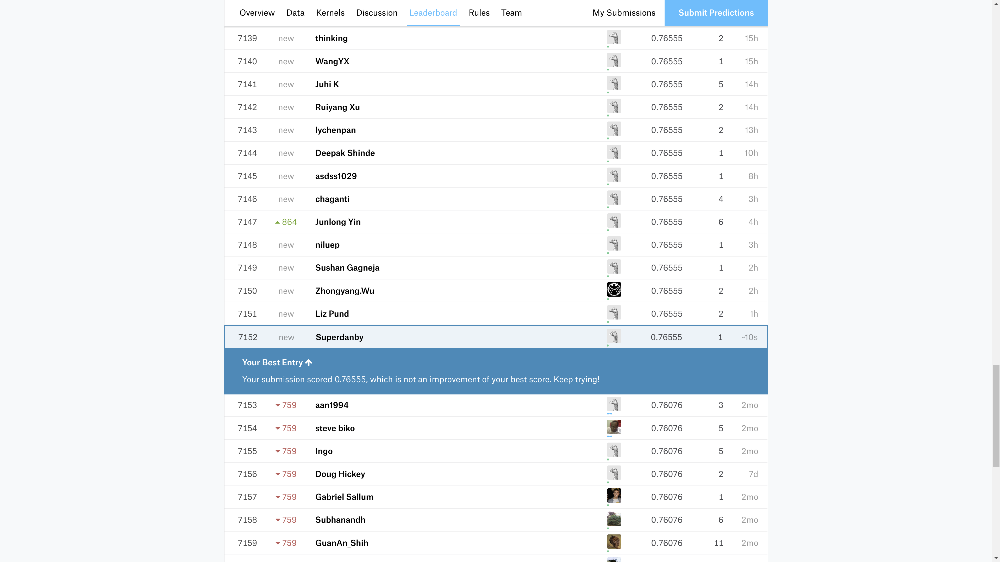

## 目標

拿到各項比賽第一名
